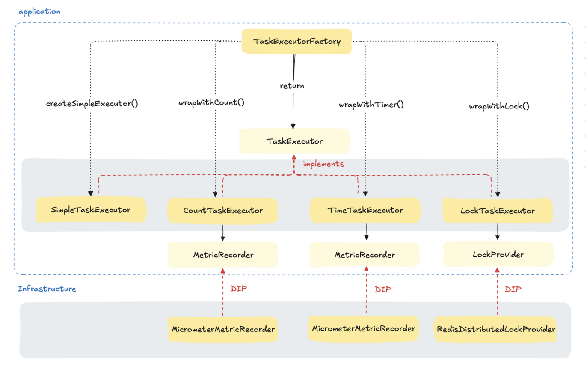

## 시작하며

기존 스케줄러 코드는 다음과 같은 문제를 안고 있었다

- 메트릭 기록, 락 획득, 예외 처리 등 여러 부가 기능이 한 메서드에 집중됨

- 코드 중첩으로 가독성이 떨어짐

- 기능 추가/변경 시 메서드를 직접 수정해야 하는 구조


이러한 문제는 SOLID 원칙을 위반하고 있었고, 이를 해결하기 위해 데코레이터 패턴을 적용하였다.

---

## 데코레이터 패턴이란?

객체에 추가 책임(기능)을 **동적으로 추가**할 수 있도록 돕는 구조적 디자인 패턴이다. 상속을 사용하지 않고도 기능 확장이 가능하여 유연성을 높인다.

**핵심 개념:**

- 대상 객체를 감싸는 래퍼 클래스를 정의

- 원본 객체와 동일한 인터페이스를 구현

- 기능을 추가하면서 원래 기능은 위임 (delegation)

- 여러 데코레이터를 중첩해서 기능 조합 가능


**이 구현에서의 특징:**

- 프로그래밍 방식으로 조합: 코드 내에서 직접 데코레이터들을 조립하여 원하는 순서와 구성을 정확히 제어할 수 있다.
- 명시적 생성 및 래핑 방식: 스프링의 자동 주입 대신, 코드에서 직접 객체를 생성하고 감싸는 방식을 사용했다. 이렇게 하면 "이 객체는 이렇게 구성됐다"가 코드상에 명확히 드러남
- 선택적, 조건적 적용 가능: 상황에 따라 필요한 기능만 골라서 조합할 수 있다.


**장점:**

- 클래스 계층 구조를 만들지 않고도 기능 확장 가능

- 런타임에 책임을 동적으로 조합 가능

- 객체 조합을 통해 기능 확장 (SRP, OCP 적용)


---

## 문제 상황 (As-Is)

```java
@Scheduled(cron = "${review.rating.update.cron}")
public void updateRestaurantRecentRatings() {
  metricRecorder.recordTime("review.scheduler.update.recent.rating", () ->
    lockExecutor.execute("recent-lock", () -> {
      try {
        LocalDateTime end = LocalDateTime.now();
        LocalDateTime start = end.minusMinutes(recentMinutes);
        logStartBatch();
        updateRestaurantRatingUseCase.execute(start, end);
      } catch (Exception e) {
        logError(e);
      }
    })
  );
}
```

### 문제점 (SOLID 관점)

- **SRP 위반**: 메서드가 여러 책임을 동시에 수행

- **OCP 위반**: 부가 기능 추가 시 직접 수정 필요

- **결합도 증가**: MetricRecorder, LockProvider와 직접 결합


> 💡 "Timed 어노테이션 쓰면 되지 않나요?"  
> 어노테이션은 항상 실행되며, 조건부 적용이 어렵다. 스케줄러의 경우 락 획득 이후에만 메트릭을 기록하는 것이 유의미하다고 판단했다.

---

## 개선 방향 (To-Be): SOLID 원칙 준수



| 원칙  | 적용 방식                                     |
| --- |-------------------------------------------|
| SRP | 각 책임을 독립된 클래스로 분리(Lock, Count, Time)      |
| OCP | 새로운 기능은 새 데코레이터 추가로 확장(Factory에만 추가하면 됨)  |
| LSP | 모든 구현체는 동일 인터페이스 사용 가능(TaskExecutor)      |
| ISP | 단일 인터페이스(TaskExecutor) 정의                 |
| DIP | MetricRecorder, LockProvider를 인터페이스 기반 의존 |

---

## 코드 구현

### TaskExecutor 인터페이스

```java
public interface TaskExecutor {
    void execute(Runnable task);
}
```

### SimpleTaskExecutor

```java
public class SimpleTaskExecutor implements TaskExecutor {
    public void execute(Runnable task) {
        task.run();
    }
}
```

### CountTaskExecutor

```java
@Builder
public class CountTaskExecutor implements TaskExecutor {
    private final TaskExecutor delegate;
    private final MetricRecorder metricRecorder;
    private final String metricName;

    public void execute(Runnable task) {
        try {
            delegate.execute(task);
            metricRecorder.countSuccess(metricName);
        } catch (RuntimeException e) {
            metricRecorder.countFailure(metricName);
            throw e;
        }
    }
}
```

### TimedTaskExecutor

```java
@Builder
public class TimedTaskExecutor implements TaskExecutor {
    private final TaskExecutor delegate;
    private final MetricRecorder metricRecorder;
    private final String metricName;

    public void execute(Runnable task) {
        metricRecorder.recordTime(metricName, () -> delegate.execute(task));
    }
}
```

### LockTaskExecutor

```java
@Builder
public class LockTaskExecutor implements TaskExecutor {
    private final TaskExecutor delegate;
    private final LockProvider lockProvider;
    private final String lockKey;

    public void execute(Runnable task) {
        lockProvider.execute(lockKey, () -> delegate.execute(task));
    }
}
```

### TaskExecutorFactory

```java
@Component
@RequiredArgsConstructor
public class TaskExecutorFactory {
    private final LockProvider lockProvider;
    private final MetricRecorder metricRecorder;

    public TaskExecutor createSchedulerExecutor(MetricName metric, LockKey lockKey) {
        TaskExecutor base = new SimpleTaskExecutor();
        TaskExecutor counted = wrapWithCount(base, metric);
        TaskExecutor timed = wrapWithTimer(counted, metric);
        return wrapWithLock(timed, lockKey);
    }

    private TaskExecutor wrapWithCount(TaskExecutor delegate, MetricName metric) { ... }
    private TaskExecutor wrapWithTimer(TaskExecutor delegate, MetricName metric) { ... }
    private TaskExecutor wrapWithLock(TaskExecutor delegate, LockKey lockKey) { ... }
}
```

### 최종 스케줄러

```java
@Scheduled(cron = "${review.rating.update.recent.cron}")
public void updateRestaurantRecentRatings() {
    TaskExecutor executor = executorFactory.createSchedulerExecutor(
        MetricName.RATING_UPDATE_RECENT,
        LockKey.RATING_UPDATE_RECENT
    );

    executor.execute(() -> {
        try {
            logStartBatch();
            LocalDateTime end = LocalDateTime.now();
            LocalDateTime start = end.minusMinutes(recentMinutes);
            updateRestaurantRatingUseCase.execute(start, end);
        } catch (Exception e) {
            logError(e);
        }
    });
}
```

---

## 적용 효과

- **코드 명확성**: 스케줄러 메서드가 간결하고 의도가 명확해졌다

- **유지보수성 향상**: 각 기능이 독립적으로 분리되어 변경 영향 범위가 감소

- **확장성**: 새로운 기능이 필요하면 기존 코드 수정 없이 새 데코레이터 추가만으로 가능(서비스 클래스의 변경을 최소화할 수 있다)

- **유연한 조합**: 상황에 따라 필요한 기능만 선택적으로 조합 가능

- **코드 재사용**: 각 데코레이터는 다른 컨텍스트에서도 독립적으로 재사용 가능

---

## 전통적인 데코레이터 패턴과의 비교

```java
// 인터페이스
public interface OrderService { void processOrder(Order order); }

// 기본 구현체
@Service
public class OrderServiceImpl implements OrderService { ... }

// 데코레이터
@Primary
@Service
public class LoggingOrderServiceDecorator implements OrderService {
    private final OrderService delegate;
    public void processOrder(Order order) {
        log.info("Start");
        delegate.processOrder(order);
        log.info("End");
    }
}
```

**차이점:**

- **전통적 방식**: 스프링 IoC 컨테이너를 통한 자동 의존성 주입과 빈 등록

- **이 구현**: 프로그래밍적 조립으로 더 세밀한 제어와 조건부 적용 가능


**공통점:**
- 컴포지션을 통한 기능 확장
- 인터페이스 기반 설계로 유연성 확보
- 실행 시점에 책임 추가 가능

---

## 확장 아이디어: 빌더 패턴 도입

```java
TaskExecutor executor = TaskExecutorBuilder.create()
    .withCount(MetricName.RATING_UPDATE_RECENT)
    .withTimer(MetricName.RATING_UPDATE_RECENT)
    .withLock(LockKey.RATING_UPDATE_RECENT)
    .build();
```

- **유연한 조합**: 필요한 기능만 선택적으로 포함 가능

- **가독성 향상**: 팩토리보다 의도가 명확하게 드러남

- **순서 제어**: 데코레이터 적용 순서를 명시적으로 제어 가능

---

## 균형 잡힌 관점

데코레이터 패턴의 적용은 다음과 같은 균형을 고려해야 한다:

- **적용 범위**: 복잡한 조건부 로직이나 다양한 조합이 필요한 상황에서 가치가 높음

- **코드 복잡성 vs 유연성**: 추가 클래스는 초기 복잡성을 증가시키지만 장기적 유연성 제공

- **팀 이해도**: 패턴에 익숙한 팀에서는 의사소통과 유지보수가 더 용이해짐
