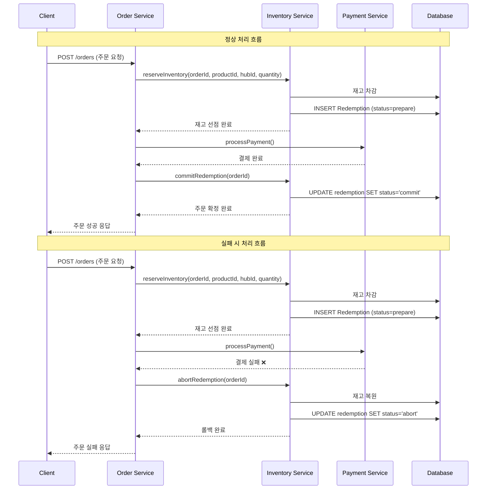

## 시작하며

마이크로서비스 아키텍처(MSA)가 널리 채택되면서, 기존 모놀리식 구조에서는 간단했던 트랜잭션 관리가 복잡한 문제로 대두됐다. 특히 주문과 재고 관리 같은 핵심 비즈니스 로직이 서로 다른 서비스로 분리되면서, **분산 트랜잭션의 일관성 보장**이 가장 큰 도전 과제 중 하나가 됐다.

이 글에서는 무거운 2PC(Two-Phase Commit) 트랜잭션을 사용하지 않으면서도, 재고 차감과 주문 확정 간의 일관성을 효과적으로 보장할 수 있는 **Redemption 테이블 기반 상태 저장 전략**을 소개한다.

## 문제 상황: MSA에서의 분산 트랜잭션 딜레마

### 전통적인 모놀리식 환경

```sql
BEGIN TRANSACTION;
  UPDATE inventory SET quantity = quantity - 1 WHERE product_id = 123;
  INSERT INTO orders (user_id, product_id, quantity) VALUES (456, 123, 1);
COMMIT;
```

모놀리식 환경에서는 단일 데이터베이스 트랜잭션으로 재고 차감과 주문 생성을 원자적으로 처리할 수 있었다.

### MSA 환경의 도전

```
Order Service (주문 서비스)     Inventory Service (재고 서비스)
     |                              |
     |-- 재고 차감 요청 -->          |
     |   (product_id, hub_id)       |-- 특정 허브 재고 차감 실행
     |                              |
     |-- 주문 생성 -->               |
     |                              |
     |-- 결제 처리 -->               |
     |                              |
     |-- 주문 확정 -->               |
```

MSA 환경에서는 각 서비스가 독립적인 데이터베이스를 사용하기 때문에, 단일 트랜잭션으로 묶을 수 없다. 특히 **멀티 허브 환경**에서는 `product_id`와 `hub_id`의 복합키로 재고를 관리하기 때문에 더욱 복잡한 상황이 발생할 수 있다:

1. **특정 허브의 재고는 차감되었지만 주문이 실패**하는 경우 (롤백 필요)
2. **네트워크 장애로 인한 응답 손실**
    - 주문 서비스에서 확정 요청을 보냈지만 재고 서비스가 받지 못한 경우 (타임아웃 예외. 정상동작)
    - 재고 서비스에서 차감 성공 응답을 보냈지만 주문 서비스가 받지 못한 경우 (재고는 차감되었는데 주문서비스가 죽어버린경우)
3. **중복 요청으로 인한 동일 허브 재고 과다 차감** (타임아웃 → 재시도를 주문 서비스에서 수행한 경우)
    1. 해당 경우는 타임아웃으로 인해 요청을 보내두었지만 주문에서 실패한것으로 보고 요청을 재시도 한경우, 그 사이에 재고는 차감된 경우이다.

## 해결 방안: Redemption 테이블 기반 상태 관리

### 핵심 아이디어

Redemption 테이블을 활용한 접근 방식의 핵심은 **"선 실행 후 상태 기록"**이다. 재고 차감을 즉시 실행하되, 그 상태를 별도 테이블에 기록하여 나중에 확정(commit) 또는 롤백(abort)할 수 있도록 하는 것이다.

### Redemption 테이블 설계

```sql
CREATE TABLE redemption (
    id BIGINT PRIMARY KEY AUTO_INCREMENT,
    order_id VARCHAR(50) NOT NULL UNIQUE,
    product_id BIGINT NOT NULL,
    hub_id BIGINT NOT NULL,
    quantity INT NOT NULL,
    status ENUM('prepare', 'commit', 'abort') NOT NULL,
    created_at TIMESTAMP DEFAULT CURRENT_TIMESTAMP,
    updated_at TIMESTAMP DEFAULT CURRENT_TIMESTAMP ON UPDATE CURRENT_TIMESTAMP,
    expired_at TIMESTAMP NOT NULL,
    
    INDEX idx_status_expired (status, expired_at),
    INDEX idx_order_id (order_id),
    INDEX idx_product_hub (product_id, hub_id)
);
```

**각 필드의 역할:**

- `order_id`: 주문 식별자 (중복 요청 방지)
- `product_id`, `hub_id`: 재고 복합키 (특정 허브의 특정 상품 재고를 식별)
- `quantity`: 차감할 재고 수량
- `status`: 현재 상태 (`prepare` → `commit` 또는 `abort`)
- `expired_at`: 타임아웃 기준 시간

### 상태 전이 다이어그램

```
    주문 요청
       |
       v
   [prepare] ──────────────> [abort]
       |                      ^
       |                      |
       v                      |
   [commit]               타임아웃
```

## 구현 상세

### 1단계: 재고 선점 (Prepare)

주문 요청이 들어오면 재고 서비스에서 다음과 같이 처리한다:

```java
@Transactional
public RedemptionResult reserveInventory(String orderId, Long productId, Long hubId, int quantity) {
    // 1. 중복 요청 확인 
    if (redemptionRepository.existsByOrderId(orderId)) {
        return RedemptionResult.ALREADY_PROCESSED;
    }
    
    // 2. 재고 확인 및 차감 (복합키로 조회) , 기본적으로 락이 걸려있다고 가정
    Inventory inventory = inventoryRepository.findByProductIdAndHubId(productId, hubId);
    if (inventory == null || inventory.getQuantity() < quantity) {
        return RedemptionResult.INSUFFICIENT_INVENTORY;
    }
    
    inventory.decrease(quantity);
    inventoryRepository.save(inventory);
    
    // 3. Redemption 상태 기록
    Redemption redemption = Redemption.builder()
        .orderId(orderId)
        .productId(productId)
        .hubId(hubId)
        .quantity(quantity)
        .status(RedemptionStatus.PREPARE)
        .expiredAt(LocalDateTime.now().plusMinutes(10)) // 10분 타임아웃
        .build();
    
    redemptionRepository.save(redemption);
    
    return RedemptionResult.SUCCESS;
}
```

### 2단계: 주문 확정 (Commit)

주문 서비스에서 결제가 완료되면 재고 서비스에 확정 신호를 보낸다:

```java
@Transactional
public void commitRedemption(String orderId) {
    Redemption redemption = redemptionRepository.findByOrderId(orderId)
        .orElseThrow(() -> new RedemptionNotFoundException(orderId));
    
    if (redemption.getStatus() != RedemptionStatus.PREPARE) {
        throw new InvalidRedemptionStateException(orderId, redemption.getStatus());
    }
    
    redemption.commit();
    redemptionRepository.save(redemption);
    
    // 이벤트 발행 (선택사항)
    eventPublisher.publishEvent(new InventoryCommittedEvent(orderId, redemption.getProductId(), redemption.getHubId()));
}
```

### 3단계: 롤백 처리 (Abort)

주문 취소 또는 타임아웃 시 재고를 복원한다:

```java
@Transactional
public void abortRedemption(String orderId) {
    Redemption redemption = redemptionRepository.findByOrderId(orderId)
        .orElseThrow(() -> new RedemptionNotFoundException(orderId));
    
    if (redemption.getStatus() != RedemptionStatus.PREPARE) {
        return; // 이미 처리됨 (commit, abort 인 경우)
    }
    
    // 재고 복원 (복합키로 조회)
    Inventory inventory = inventoryRepository.findByProductIdAndHubId(
        redemption.getProductId(), redemption.getHubId());
    inventory.increase(redemption.getQuantity());
    inventoryRepository.save(inventory);
    
    // 상태 변경
    redemption.abort();
    redemptionRepository.save(redemption);
}
```

### 4단계: 자동 타임아웃 처리

스케줄러를 통해 만료된 Redemption을 자동으로 롤백한다:

```java
@Scheduled(fixedDelay = 60000) // 1분마다 실행
public void processExpiredRedemptions() {
    List<Redemption> expiredRedemptions = redemptionRepository
        .findByStatusAndExpiredAtBefore(RedemptionStatus.PREPARE, LocalDateTime.now());
    
    for (Redemption redemption : expiredRedemptions) {
        try {
            abortRedemption(redemption.getOrderId());
            log.info("Expired redemption aborted: {}", redemption.getOrderId());
        } catch (Exception e) {
            log.error("Failed to abort expired redemption: {}", redemption.getOrderId(), e);
        }
    }
}
```

## 시퀀스 다이어그램



## 실제 장애 시나리오와 대응 방안

### 시나리오 1: 주문 실패 시 롤백

```
1. 재고 서비스: 재고 차감 + Redemption(prepare) 생성 ✅
2. 주문 서비스: 결제 처리 실패 ❌
3. 주문 서비스: abortRedemption() 호출
4. 재고 서비스: 재고 복원 + Redemption(abort) 변경 ✅
```

### 시나리오 2: 네트워크 장애

**2-1. 확정 요청 손실**

```
1. 재고 서비스: 재고 차감 + Redemption(prepare) 생성 ✅
2. 주문 서비스: 결제 완료 후 commitRedemption() 호출
3. 네트워크 장애로 재고 서비스에 도달 안됨 ❌
4. 10분 후 타임아웃으로 자동 롤백 처리 ✅
```

**2-2. 차감 응답 손실**

```
1. 재고 서비스: 재고 차감 + Redemption(prepare) 생성 ✅
2. 네트워크 장애로 주문 서비스가 응답 못받음 ❌
3. 주문 서비스: 타임아웃으로 재시도 시도
4. 재고 서비스: orderId 중복 체크로 ALREADY_PROCESSED 반환 ✅
```

### 시나리오 3: 중복 요청 처리

```
1. 주문 서비스: reserveInventory() 호출
2. 재고 서비스: 처리 중 응답 지연
3. 주문 서비스: 타임아웃으로 재시도
4. 재고 서비스: 첫 번째 요청 완료 + 두 번째 요청은 중복으로 차단 ✅
```

## 장점과 특징

### 네트워크 장애 대응력

- **타임아웃 기반 자동 복구**: 확정 신호를 받지 못한 경우 자동 롤백
- **멱등성 보장**: 중복 요청 시 안전한 처리로 과다 차감 방지
- **응답 손실 대응**: orderId 기반 중복 체크로 재시도 안전성 확보

### 성능 최적화

- **선 실행 후 상태 기록**: 재고 차감을 즉시 실행하여 응답 시간 최소화
- **비동기 처리**: 확정/롤백 처리를 비동기로 수행 가능
- **인덱스 최적화**: 상태와 만료 시간 기준 인덱스로 빠른 조회

### 일관성 보장

- **멱등성**: 동일한 `orderId`로 중복 요청 시 안전하게 처리
- **자동 복구**: 타임아웃 기반 자동 롤백으로 장애 상황 대응
- **상태 추적**: 모든 상태 변화를 기록하여 디버깅과 모니터링 용이

## 고려사항과 한계

### 데이터 일관성 레벨

이 방식은 **최종 일관성(Eventual Consistency)**을 제공한다. 재고 차감 후 주문 확정까지의 시간 동안 다른 사용자가 해당 재고를 볼 수 없다는 점을 고려해야 한다.

### 메모리 사용량

`prepare` 상태의 Redemption 레코드가 메모리에 누적될 수 있으므로, 적절한 타임아웃 설정과 정기적인 정리가 필요하다.

### 복잡성 증가

단순한 재고 차감 로직이 상태 관리 로직으로 확장되면서 코드 복잡성이 증가할 수 있다.