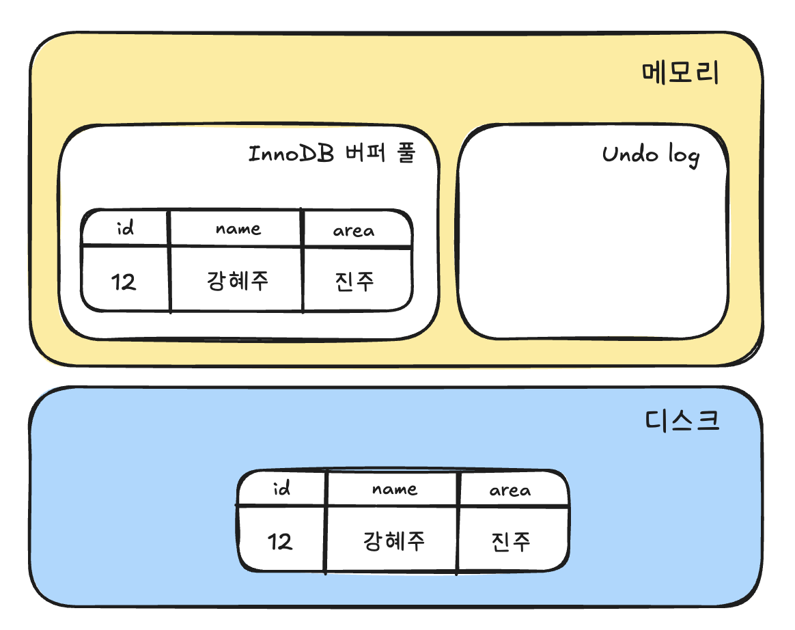
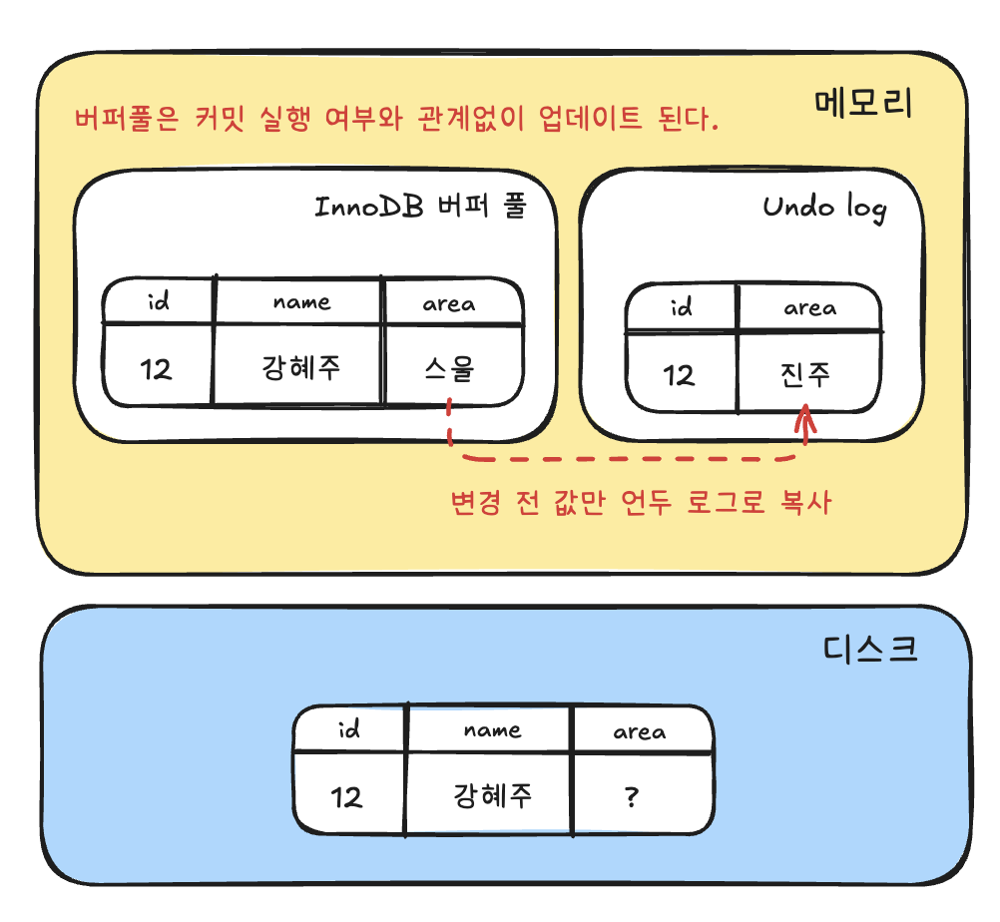

## MVCC(Multi Version Concurrency Control)
레코드 레벨의 트랜잭션을 지원하는 DBMS가 제공하는 기능이며, MVCC의 가장 목적은 잠금을 사용하지 않는 일관된 읽기를 제공함에 있다.
InnoDB는 Undo log를 통해 MVCC를 구현한다.
> Multi Version : 하나의 레코드에 대해 여러개의 버전이 관리된다는 의미

### MySQL에서의 MVCC
MySQL의 InnoDB 는 언두로그를 활용해서 MVCC를 구현한다.
다음과 같은 테이블에 한건의 레코드를 INSERT 후 UPDATE 해서 발생하는 절차를 확인해보자.

1. INSERT

```sql
CREATE TABLE member (
	id INT NOT NULL,
	name VARCHAR(20) NOT NULL,
	area VARCHAR(100) NOT NULL,
	PRIMARY KEY(id)
);

INSERT INTO member (id, name, area) VALUES (12, '강혜주', '진주');
COMMIT;
```

위 INSERT 문이 실행되면 데이터베이스의 상태는 아래와 같이 바뀐다.



2. UPDATE
```sql
UPDATE member SET area = '스울' WHERE id = 12;
-- 커밋은 아직 하지 않은 상태
```


3. SELECT (다른 세션)
```sql
SELECT * FROM member WHERE id = 12;
```

커밋 되지 않은 상태에서 다른 세션에서 레코드 조회시 (격리 수준별)

- READ UNCOMMITTED
    - 커밋 여부와 관계없이 버퍼풀의 가장 최신의 데이터를 읽음 (스울)
- READ COMMITTTED, REAPEATABLE READ, SERIALIZABLE
    - 언두 로그의 데이터를 반환한다. (진주)

이러한 과정을 MVCC라고 표현한다. 하나의 레코드 (강혜주)에 대해 2개의 버전이 유지되고 필요에 따라 어느 데이터가 보여지는지는 상황에 따라 달라지는 구조를 말한다.


4. COMMIT / ROLLBACK

커밋시에는 현재 상태를 영구적으로 디스크에 반영하게 된다.
롤백시에는 Undo log의 백업 데이터를 버퍼풀로 다시 복구하고, 언두 영역의 내용을 삭제한다.

### 격리수준에 따른 스냅샷 생성시점

#### READ COMMITTED: 쿼리별 스냅샷
**매 쿼리마다 새로운 스냅샷 생성**

```sql
BEGIN;
SELECT * FROM users WHERE id = 1; -- 스냅샷1: 10:00 시점
-- 다른 트랜잭션이 UPDATE 후 COMMIT
SELECT * FROM users WHERE id = 1; -- 스냅샷2: 10:01 시점 (변경된 데이터 읽음)
COMMIT;
```

- **장점**: 최신 커밋된 데이터를 읽을 수 있음
- **단점**: Non-repeatable Read 발생 가능
#### REPEATABLE READ: 트랜잭션별 고정 스냅샷
**트랜잭션 시작 시 스냅샷 고정, 끝까지 유지**

```sql
BEGIN; -- 이 시점(10:00)의 스냅샷으로 고정
SELECT * FROM users WHERE id = 1; -- 10:00 스냅샷 데이터
-- 다른 트랜잭션이 UPDATE 후 COMMIT (10:01)
SELECT * FROM users WHERE id = 1; -- 여전히 10:00 스냅샷 데이터 (동일한 결과)
COMMIT;
```
- **장점**: 트랜잭션 내에서 일관된 읽기 보장
- **단점**: Phantom Read 여전히 가능

#### SERIALIZABLE: MVCC + 직렬화 검사
**REPEATABLE READ + 추가 검증**

```sql
-- 트랜잭션 A
BEGIN ISOLATION LEVEL SERIALIZABLE;
SELECT SUM(amount) FROM accounts; -- 총합: 1000

-- 트랜잭션 B (동시 실행)
INSERT INTO accounts (amount) VALUES (500);
COMMIT;

-- 트랜잭션 A 계속
SELECT SUM(amount) FROM accounts; -- 여전히 1000 (스냅샷 고정)
UPDATE accounts SET amount = amount + 100; -- 직렬화 오류 발생!
-- ERROR: could not serialize access
```
##### 직렬화 검사 메커니즘
1. **Read-Write 의존성 추적**: 어떤 데이터를 읽고 썼는지 기록
2. **충돌 탐지**: 다른 트랜잭션과의 의존성 순환 검사
3. **롤백 결정**: 순환이 발견되면 한 트랜잭션을 롤백

### 잠금 없는 일관된 읽기(Non-Locking Consistent Read)

InnoDB 엔진은 MVCC 기술을 이용해 잠금을 걸지 않고 읽기 작업을 수행한다.
격리수준이 SERIALIZABLE이 아닌 경우, INSERT 와 연결되지 않은 순수한 읽기(SELECT) 작업은 다른 트랜잭션의 변경 작업과 관계없이 항상 잠금을 대기하지 않고 바로 실행된다.


특정 사용자가 레코드를 변경하고 아직 커밋을 수행하지 않았다 하더라도 이 변경 트랜잭션이 다른 사용자의 Select 작업을 방해하지 않는다. 이를 잠금 없는 일관된 읽기 라고 표현하며, InnoDB에서는 이를 위해 UndoLog 를 사용한다.

> 오랫동안 활성상태인 트랜잭션으로 인해 MySQL 서버가 느려질때가 있는데, 이는 일관된 읽기를 위해 Undo log 를 삭제하지 못하고 계속 유지하기 때문이다. 따라서 트랜잭션이 시작됐다면 가능한 한 빨리 롤백이나 커밋을 통해 트랜잭션을 완료하는 것이 좋다.