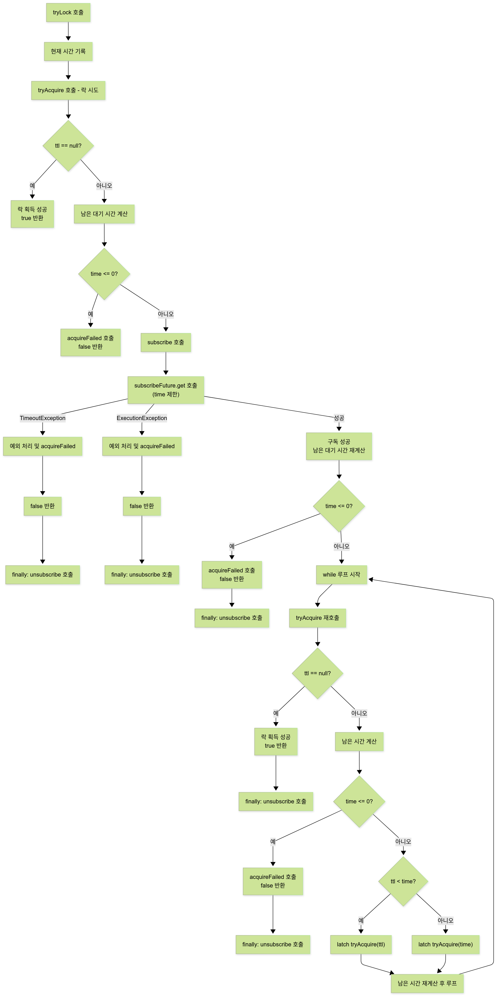
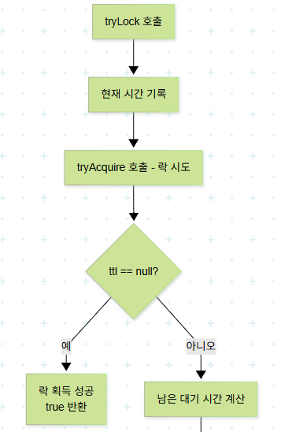
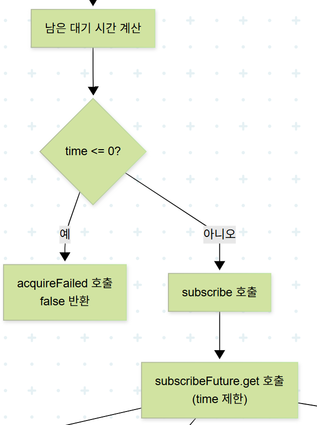
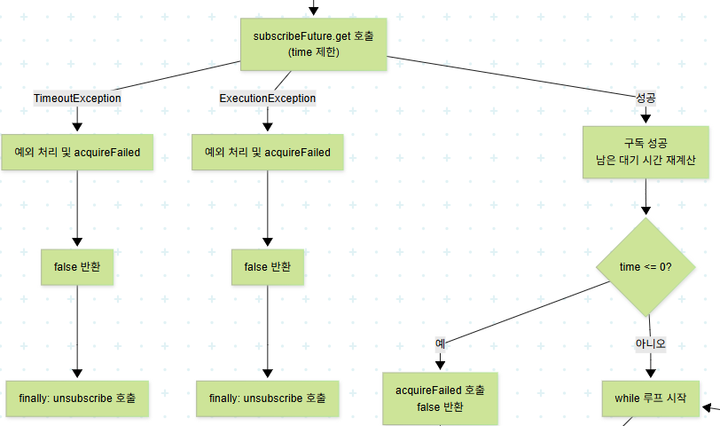
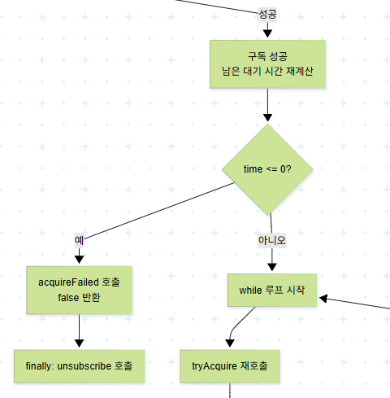
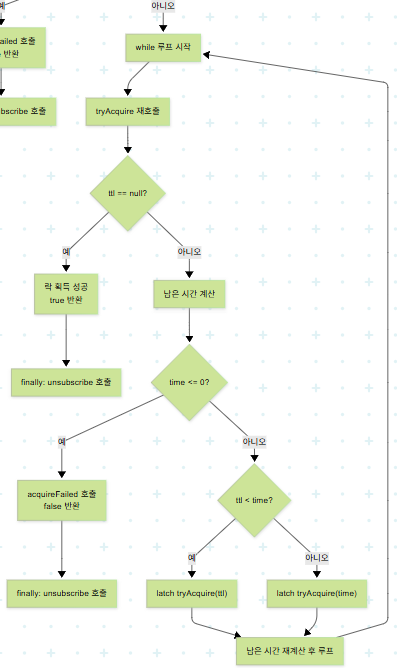

# Redisson의 RedissonLock: tryLock

Redisson의 RedissonLock은 위의 Redis Pub/Sub 기능을 활용하여 Lock 기능을 제공한다.

락을 점유하는 `tryLock` 을 살펴보자.

## 전체 코드
```java
@Override
public boolean tryLock(long waitTime, long leaseTime, TimeUnit unit) throws InterruptedException {
    long time = unit.toMillis(waitTime);
    long current = System.currentTimeMillis();
    long threadId = Thread.currentThread().getId();
    Long ttl = tryAcquire(waitTime, leaseTime, unit, threadId);
    // lock 획득
    if (ttl == null) {
        return true;
    }
    
    time -= System.currentTimeMillis() - current;
    if (time <= 0) {
        acquireFailed(waitTime, unit, threadId);
        return false;
    }
    
    current = System.currentTimeMillis();
    CompletableFuture<RedissonLockEntry> subscribeFuture = subscribe(threadId);
    try {
        subscribeFuture.get(time, TimeUnit.MILLISECONDS);
    } catch (TimeoutException e) {
        if (!subscribeFuture.completeExceptionally(new RedisTimeoutException(
                "Unable to acquire subscription lock after " + time + "ms. " +
                        "Try to increase 'subscriptionsPerConnection' and/or 'subscriptionConnectionPoolSize' parameters."))) {
            subscribeFuture.whenComplete((res, ex) -> {
                if (ex == null) {
                    unsubscribe(res, threadId);
                }
            });
        }
        acquireFailed(waitTime, unit, threadId);
        return false;
    } catch (ExecutionException e) {
        LOGGER.error(e.getMessage(), e);
        acquireFailed(waitTime, unit, threadId);
        return false;
    }

    try {
        time -= System.currentTimeMillis() - current;
        if (time <= 0) {
            acquireFailed(waitTime, unit, threadId);
            return false;
        }
    
        while (true) {
            long currentTime = System.currentTimeMillis();
            ttl = tryAcquire(waitTime, leaseTime, unit, threadId);
            // lock acquired
            if (ttl == null) {
                return true;
            }

            time -= System.currentTimeMillis() - currentTime;
            if (time <= 0) {
                acquireFailed(waitTime, unit, threadId);
                return false;
            }

            // waiting for message
            currentTime = System.currentTimeMillis();
            if (ttl >= 0 && ttl < time) {
                commandExecutor.getNow(subscribeFuture).getLatch().tryAcquire(ttl, TimeUnit.MILLISECONDS);
            } else {
                commandExecutor.getNow(subscribeFuture).getLatch().tryAcquire(time, TimeUnit.MILLISECONDS);
            }

            time -= System.currentTimeMillis() - currentTime;
            if (time <= 0) {
                acquireFailed(waitTime, unit, threadId);
                return false;
            }
        }
    } finally {
        unsubscribe(commandExecutor.getNow(subscribeFuture), threadId);
    }
//        return get(tryLockAsync(waitTime, leaseTime, unit));
}
```

### 전체 흐름


- tryLock()은 "주어진 시간 내에 락을 얻을 수 있으면 true, 아니면 false"를 반환한다.
1. tryAcquire 락 획득 첫 시도
    
    
   
   - ttl이 없으면 락 획득을 바로 성공한다.(=락을 얻으면 return true)
   - 못 얻으면 락 대기 구독 요청 시작 (subscribe(threadId))
2. 남은 대기 시간 계산
   
   
      - 계산된 대기 시간이 0보다 작거나 같으면 실패한다.
      - 0보다 크면 구독을 진행한다.
3. subscribe
   
      
  - 첫 번째 시도에서 락을 얻지 못했다면, 락이 해제될 때까지 구독(subscribe) 상태로 기다린다.
  - 위에서 TTL을 리턴 받았다면(다른 스레드가 락 점유 중) 현재 스레드는 Lock Name에 해당하는 채널에 구독한다.   
4. 구독 성공
   
      
5. while 시작
   
   
   - 락(lock)을 획득하기 위해 정해진 시간(waitTime) 동안 반복해서 시도한다.
   - waitTime 내에 락을 얻으면 true, 끝까지 못 얻으면 false

## RedissonLock: tryAcquire
```java
private Long tryAcquire(long waitTime, long leaseTime, TimeUnit unit, long threadId) {
    return get(tryAcquireAsync0(waitTime, leaseTime, unit, threadId));
}

private RFuture<Long> tryAcquireAsync0(long waitTime, long leaseTime, TimeUnit unit, long threadId) {
  return getServiceManager().execute(() -> tryAcquireAsync(waitTime, leaseTime, unit, threadId));
}

private RFuture<Long> tryAcquireAsync(long waitTime, long leaseTime, TimeUnit unit, long threadId) {
  RFuture ttlRemainingFuture;
  if (leaseTime > 0L) {
    ttlRemainingFuture = this.tryLockInnerAsync(waitTime, leaseTime, unit, threadId, RedisCommands.EVAL_LONG);
  } else {
    ttlRemainingFuture = this.tryLockInnerAsync(waitTime, this.internalLockLeaseTime, TimeUnit.MILLISECONDS, threadId, RedisCommands.EVAL_LONG);
  }

  CompletionStage<Long> s = this.handleNoSync(threadId, ttlRemainingFuture);
  RFuture<Long> ttlRemainingFuture = new CompletableFutureWrapper(s);
  CompletionStage<Long> f = ttlRemainingFuture.thenApply((ttlRemaining) -> {
    if (ttlRemaining == null) {
      if (leaseTime > 0L) {
        this.internalLockLeaseTime = unit.toMillis(leaseTime);
      } else {
        this.scheduleExpirationRenewal(threadId);
      }
    }

    return ttlRemaining;
  });
  return new CompletableFutureWrapper(f);
}

<T> RFuture<T> tryLockInnerAsync(long waitTime, long leaseTime, TimeUnit unit, long threadId, RedisStrictCommand<T> command) {
  return evalWriteSyncedNoRetryAsync(getRawName(), LongCodec.INSTANCE, command,
      "if ((redis.call('exists', KEYS[1]) == 0) " +
          "or (redis.call('hexists', KEYS[1], ARGV[2]) == 1)) then " +
          "redis.call('hincrby', KEYS[1], ARGV[2], 1); " +
          "redis.call('pexpire', KEYS[1], ARGV[1]); " +
          "return nil; " +
          "end; " +
          "return redis.call('pttl', KEYS[1]);",
      Collections.singletonList(getRawName()), unit.toMillis(leaseTime), getLockName(threadId));
}
```
### 스크립트를 살펴보자
```redis
if (
  (redis.call('exists', KEYS[1]) == 0)  -- 락이 존재하지 않거나
  or 
  (redis.call('hexists', KEYS[1], ARGV[2]) == 1)  -- 해당 threadId가 이미 락을 보유 중이면
)
then
  redis.call('hincrby', KEYS[1], ARGV[2], 1);  -- 재진입 횟수 +1
  redis.call('pexpire', KEYS[1], ARGV[1]);     -- 락 TTL 재설정
  return nil;  -- 락 획득 성공
end;

return redis.call('pttl', KEYS[1]);  -- 락 획득 실패 → 남은 TTL 반환
```
| 파라미터      | 의미                                     |
| --------- | -------------------------------------- |
| `KEYS[1]` | 락 키 이름 (`getRawName()`로 생성됨)           |
| `ARGV[1]` | TTL (밀리초) – `unit.toMillis(leaseTime)` |
| `ARGV[2]` | 락 요청한 쓰레드 ID – `getLockName(threadId)` |

| 명령어         | 설명                   |
| ----------- | -------------------- |
| `HEXISTS`   | 해시의 필드 존재 여부 확인      |
| `HINCRBY`   | 해시 필드 값 증가           |
| `PEXPIRE`   | 키의 만료 시간 설정 (ms 단위)  |
| `PTTL`      | 키의 남은 TTL 반환 (ms 단위) |
| `nil` (Lua) | 값 없음 (null)          |


- 락 키 (KEYS[1])가 없거나,락을 현재 스레드(ARGV[2])가 이미 가지고 있는 경우

   → 재진입 허용 및 락 유지 시간 갱신 (재설정).
- 그 외의 경우

   → 해당 락의 남은 TTL(pttl)을 반환하여, 락이 유지되고 있음을 알림.

> 정리하면 락 획득에 성공하면 null 리턴, 획득하지 못하면 남은 TTL 값을 리턴한다.

> 🌳 왜 재진입 횟수를 저장할까?
> 
> 이유는 RedissonLock은 Reentrant Lock 인데,
>
> 락을 획득할 때마다 내부 카운트를 증가시키고, 해제 시에도 카운트를 줄이면서 0이 되면 진짜 락 해제를 하기 때문이다.
>
> 락을 이미 획득한 스레드가 다시 tryLock()을 호출했을 때, 동일 스레드면 실패하지 않고 재진입으로 처리하려면 횟수를 추적해야 한다.
> 
> ➡️ RedissonLock은 분산 환경에서도 재진입을 지원하는 Reentrant Lock이며, 스레드 ID를 기준으로 Redis에 재진입 횟수를 저장하여 이를 구현한다.
> > 재진입 가능 락 (Reentrant Lock): 동일한 스레드가 이미 획득한 락을 다시 획득할 수 있는 락

> #### 참고: RedissonObject: get
> 명령어를 만들어주는 메서드다.
> ```java
> protected final <V> V get(RFuture<V> future) {
>     return this.commandExecutor.get(future);
>   }
> ```

## RedissonLock: subscribe
```java
protected CompletableFuture<RedissonLockEntry> subscribe(long threadId) {
  return this.pubSub.subscribe(this.getEntryName(), this.getChannelName());
}
```
- subscribe의 반환 값은 Lock 채널에 해당하는 RedissonLockEntry 을 CompletableFuture로 감싼 형태다.
  - 여기서 `pubSub`이 LockPubSub 이다.
    ```java
      public class LockPubSub extends PublishSubscribe<RedissonLockEntry> {
      public static final Long UNLOCK_MESSAGE = 0L;
      public static final Long READ_UNLOCK_MESSAGE = 1L;
      
      public LockPubSub(PublishSubscribeService service) {
      super(service);
      }
      
      protected RedissonLockEntry createEntry(CompletableFuture<RedissonLockEntry> newPromise) {
      return new RedissonLockEntry(newPromise);
      }
      
      protected void onMessage(RedissonLockEntry value, Long message) {
      if (message.equals(UNLOCK_MESSAGE)) {
      value.tryRunListener();
      value.getLatch().release();
      } else if (message.equals(READ_UNLOCK_MESSAGE)) {
      value.tryRunAllListeners();
      value.getLatch().release(value.getLatch().getQueueLength());
      }
      
      }
      }
    ```
  -  `onMessage` 메서드를 보면 UNLOCK_MESSAGE(락 점유 해제)에 해당하는 메시지가 오면 latch Semaphore를 release 하는 것을 확인할 수 있다.
### PublishSubscribe<E extends PubSubEntry<E>>: subscribe

LockPubSub 이 PublishSubscribe를 구현하고 있다.

```java
public CompletableFuture<E> subscribe(String entryName, String channelName) {
    AsyncSemaphore semaphore = this.service.getSemaphore(new ChannelName(channelName));
    CompletableFuture<E> newPromise = new CompletableFuture();
    semaphore.acquire().thenAccept((c) -> {
      if (newPromise.isDone()) {
        semaphore.release();
      } else {
        E entry = (PubSubEntry)this.entries.get(entryName);
        if (entry != null) {
          entry.acquire();
          semaphore.release();
          entry.getPromise().whenComplete((r, e) -> {
            if (e != null) {
              newPromise.completeExceptionally(e);
            } else {
              newPromise.complete(r);
            }
          });
        } else {
          E value = this.createEntry(newPromise);
          value.acquire();
          E oldValue = (PubSubEntry)this.entries.putIfAbsent(entryName, value);
          if (oldValue != null) {
            oldValue.acquire();
            semaphore.release();
            oldValue.getPromise().whenComplete((r, e) -> {
              if (e != null) {
                newPromise.completeExceptionally(e);
              } else {
                newPromise.complete(r);
              }
            });
          } else {
            RedisPubSubListener<Object> listener = this.createListener(channelName, value);
            CompletableFuture<PubSubConnectionEntry> s = this.service.subscribeNoTimeout(LongCodec.INSTANCE, channelName, semaphore, new RedisPubSubListener[]{listener});
            newPromise.whenComplete((r, e) -> {
              if (e != null) {
                s.completeExceptionally(e);
              }

            });
            s.whenComplete((r, e) -> {
              if (e != null) {
                this.entries.remove(entryName);
                value.getPromise().completeExceptionally(e);
              } else {
                if (!value.getPromise().complete(value) && value.getPromise().isCompletedExceptionally()) {
                  this.entries.remove(entryName);
                }

              }
            });
          }
        }
      }
    });
    return newPromise;
  }
```

## RedissonLock: tryLock 내 락 대기 부분
```java
// waiting for message
currentTime = System.currentTimeMillis();
if (ttl >= 0 && ttl < time) {
    commandExecutor.getNow(subscribeFuture).getLatch().tryAcquire(ttl, TimeUnit.MILLISECONDS);
} else {
    commandExecutor.getNow(subscribeFuture).getLatch().tryAcquire(time, TimeUnit.MILLISECONDS);
}
```
여기서 commandExecutor.getNow(subscribeFuture).getLatch() 의 latch는
위의 `onMessage` 메서드에서 UNLOCK_MESSAGE(락 점유 해제) 때, latch Semaphore를 release 했던 세마포어다.

위 LockPubSub 에서 UNLOCK_MESSAGE(락 점유 해제)를 받으면 세마포어의 permit을 release하는 것을 볼 수 있었다.(value.getLatch().release();)

이후 Semaphore 의 tryAcquire 을 호출하여 permit이 날때까지 ttl 만큼이나 waitTime만큼 대기하다가, 다시 while 문을 타면서 Lock 점유 시도를 하는 방식으로 동작하는 것이다.

> 🌳 참고: [세마포어](https://jepa.tistory.com/7#%EC%84%B8%EB%A7%88%ED%8F%AC%EC%96%B4%20(Semaphore)-1)
> 
> 세마포어는 일정 순간 세마포어에서 정한 동시 접근 쓰레드수만큼만 공유한 데이터를 접근할 수 있도록 하는 기술이다.

## 정리
- Pub/Sub 방식인 RedissonLock은 여러 스레드에서 동일한 Lock 을 점유하려고 하는 경우에는 Lock Name에 해당하는 채널을 생성하여 구독하고, 
  Redis에 계속 Lock을 획득할 수 있는지 요청하는 것이 아니라 Semaphore 통해 구독 해제 메시지가 올 때까지 대기하거나 지정된 시간만큼(TTL 또는 waitTime) 해당 스레드가 스케줄링에서 제외되어 대기 상태(dormant)가 된다.
- RedissonLock 은 Redis Pub/Sub 기능과 Semaphore, Completablefuture 를 활용하여 Redis에 가해지는 부하를 줄이고 비동기로 동작할 수 있도록 구현되어있다.
- Spin Lock 방식과 Pub/Sub 기반 Lock 방식 둘 중 더 좋은 것은? 운영하는 프로젝트의 특성을 고려하고 성능 테스트를 진행하여 선택해야 한다.