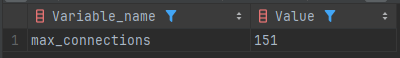
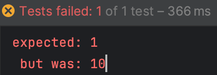
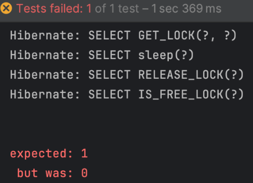

# NamedLock

> - NamedLock이란 무엇인가요?
> - NamedLock의 동작 방식은 어떤가요?
> - NamedLock을 사용할 때 주의할 점은 무엇인가요?
> - NamedLock을 언제 사용하면 좋고, 언제 피해야 하나요?
> - NamedLock은 트랜잭션과 어떤 관계가 있나요?
> - 락을 획득한 후 예외가 발생해서 RELEASE_LOCK()을 호출하지 못하고 종료되면 어떻게 될까요?

네임드락은 특정 이름에 락을 걸어 다른 세션에서 해당 이름의 락을 획득하려고 할 때 대기하게 하는 기능

- 이름을 가진 metadata locking 이다.
- 이름을 가진 락을 획득한 후 해제할 때까지 다른 session은 이 락을 획득할 수 없도록 한다.
- Pessimistic Lock은 row나 table단위로 lock을 걸지만, named lock은 메타데이터에 락킹을 하는 방법이다.
- MySQL에서는 get-lock 명령어를 통해 named-lock을 획득할 수 있고 release-lock 명령어를 통해 lock을 해제할 수 있다.
- 주로 분산락을 구현할 때 사용한다.
- 락을 관리하는 단위가 세션 단위다.
  - 모든 명령어의 기준이 세션에 의해 결정
  - 세션이 종료되면 해당 세션이 보유한 모든 락도 자동으로 해제된다
- Pessimistic Lock은 타임아웃(획득까지 기다리는 최대 시간)을 구현하기 힘들지만 Named Lock은 타임아웃을 손쉽게 구현할 수 있다.
- 주의
  - 트랜잭션이 종료될 때 락이 자동으로 해제되지 않기 때문에 별도의 명령으로 해제를 수행해주거나 선점 시간이 끝나야 해제가 된다.
    - 트랜직션 종료 시에 락 해제, 세션 관리를 잘 해줘야 되기 때문에 주의해서 사용해야 하고 실제 구현 방법이 복잡할 수 있다.

> #### 🌳 실제로 사용하실 때는 데이터 소스를 분리해서 사용해야 한다.
> 
> 같은 데이터 소스를 사용하면 커넥션 풀이 부족해지는 현상으로 인해서 다른 서비스에도 영향을 끼친다.
> 
> - 문제점: Named Lock이 커넥션을 점유해서 다른 쿼리 지연 발생
> - 해결법: Named Lock 전용 DataSource 분리해서 커넥션 풀 분리 운영
> 
> > DataSource: 커넥션 풀 관리 객체 (DB 연결 관리 단위)
> ```yaml
> spring:
>   datasource:
>     primary: # 일반 쿼리용
>     url: jdbc:mysql://...
>     hikari:
>       maximum-pool-size: 20
>   lock-datasource: # 락 전용
>     url: jdbc:mysql://... # 같은 DB라도 OK
>     hikari:
>       maximum-pool-size: 5
> ```
> 락을 사용하는 Repository만 따로 이 DataSource를 사용하게 설정한다.
> 
> → 락은 락대로, 일반 로직은 따로 동작하므로 커넥션 고갈을 방지할 수 있다.
> 
> > 참고: mysql에서 제공하는 최대 커넥션 수는 151개이다.
> >
> > ```show variables like 'max_connections';```
> > 
> > 

> #### 🌳 세션
> 
> DB 세션(Database Session) = 클라이언트(보통 웹 서버)와 DB 서버 간의 연결(Connection)
> 
> ```
> [웹 서버 A] \
> [웹 서버 B]  ---→  [공통 MySQL DB]
> [웹 서버 C] /
> ```
> - 여러 웹 서버가 동일한 DB 인스턴스에 접속하고, 각 웹 서버는 자신의 요청마다 새로운 DB 세션을 생성하거나, 커넥션 풀에서 재사용합니다.
> - DB는 이 각각의 세션을 독립적으로 관리한다.

## 문제점
| 문제                    | 설명                                                  |
|-----------------------| --------------------------------------------------- |
| **DB 단일 장애 지점(SPOF)** | DB에 문제가 생기면 락 관리도 모두 깨짐. 고가용성 구성 어렵                 |
| **락이 세션 기반**          | 락이 걸린 세션이 갑자기 종료되면 락 해제되지 않거나 불확실해짐 (세션 연결 유지에 의존)  |
| **락 점유 상태 파악 어려움**    | 락 상태를 외부에서 모니터링하거나 강제로 해제하기 어렵고 유연성 부족              |
| **DB 부하 증가**          | 락 관리를 위해 DB 접근을 더 많이 하게 되고, 이는 고트래픽 환경에서 병목이 될 수 있음 |
| **DB 간 분산 불가**        | DB를 샤딩하거나 여러 DB를 운영하면, 락이 DB 단위로 분리되어 **전역 동기화 불가** |


## GET_LOCK

GET_LOCK() 함수를 사용하여 네임드락을 획득할 수 있다.
 
- 타임아웃에 음수를 넣으면 무한정 대기하니 주의

```mysql
-- 'lock_name'이라는 이름의 락을 최대 10초 동안 시도하여 획득
SELECT GET_LOCK('lock_name', 10);
-- 성공: 1, 실패: 0
```

## RELEASE_LOCK

RELEASE_LOCK() 함수를 사용하여 네임드락을 해제할 수 있습니다.

```mysql
-- 'lock_name'이라는 이름의 락을 해제
SELECT RELEASE_LOCK('lock_name');
-- 성공: 1, 실패: 0, 락 존재X: NULL
```

## IS_FREE_LOCK

IS_FREE_LOCK() 함수를 사용하여 네임드락이 해제되었는지 확인할 수 있다.

```mysql
-- 락 사용가능: 1, 락 사용중: 0
SELECT IS_FREE_LOCK('lock_name');
```

## spring boot code

### Entity
```java
@Entity
public class Stock {
  @Id
  @GeneratedValue(strategy = GenerationType.IDENTITY)
  private Long id;

  private Long productId;

  @Getter
  private Long quantity;

  public Stock() {

  }

  public void decrease(Long quantity) {
    if (this.quantity - quantity < 0) {
      throw new RuntimeException("foo");
    }

    this.quantity -= quantity;
  }

  public Stock(Long productId, Long quantity) {
    this.productId = productId;
    this.quantity = quantity;
  }
}
```
### repository
```java
public interface LockRepository extends JpaRepository<Stock, Long> {
  @Query(value = "select get_lock(:key, 30)", nativeQuery = true)
  void getLock(String key);

  @Query(value = "select release_lock(:key)", nativeQuery = true)
  void releaseLock(String key);
}
```
- 실무에서는 별도의 jdbc를 사용한다고 한다.

### 사용
```java
@Component
@RequiredArgsConstructor
public class NamedLockStockFacade {

  private final LockRepository lockRepository;

  private final NamedLockStockService namedLockStockService;

  @Transactional
  public void decrease(Long id, Long quantity) {
    try {
      //  락 레포지토리를 활용해서 락을 획득
      lockRepository.getLock(id.toString());
      // 락 획득을 하였다면 스탁 서비스를 사용해서 재고를 감소
      namedLockStockService.decrease(id, quantity);
    } finally {
      // 모든 로직이 종료가 되었을 때 락을 해제
      lockRepository.releaseLock(id.toString());
    }
  }
}

@Service
@RequiredArgsConstructor
public class NamedLockStockService {

  private final StockRepository stockRepository;


  //스탁 서비스에서는 부모의 트랜지션과 별도로 실행이 되어야 되기 때문에 propagation을 변경
  @Transactional(propagation = Propagation.REQUIRES_NEW)
  public void decrease(Long id, Long quantity) {
    Stock stock = stockRepository.findById(id).orElseThrow();

    stock.decrease(quantity);

    stockRepository.saveAndFlush(stock);
  }
}
```

### test
```java
@SpringBootTest
class NamedLockStockFacadeTest {

  @Autowired
  private NamedLockStockFacade namedLockStockFacade;

  @Autowired
  private StockRepository stockRepository;

  @BeforeEach
  public void insert() {
    Stock stock = new Stock(1L, 100L);

    stockRepository.saveAndFlush(stock);
  }

  @AfterEach
  public void delete() {
    stockRepository.deleteAll();
  }

  @Test
  public void 동시에_100개의요청() throws InterruptedException {
    int threadCount = 100;
    ExecutorService executorService = Executors.newFixedThreadPool(32);
    CountDownLatch latch = new CountDownLatch(threadCount);

    for (int i = 0; i < threadCount; i++) {
      executorService.submit(() -> {
        try {
          namedLockStockFacade.decrease(1L, 1L);
        } finally {
          latch.countDown();
        }
      });
    }

    latch.await();

    Stock stock = stockRepository.findById(1L).orElseThrow();

    // 100 - (100 * 1) = 0
    assertEquals(0, stock.getQuantity());
  }
}
```

## 주의점
### 1. 락을 해지하지 않았다. 결과가 어떻게 될까?
```java
public void test() {
    int success = 0;
    for (int i = 0; i < 10; i++) {
        if(userRepository.acquireNamedLock("lock", 1) == 1) {
            success++;
        }
    }
    assertThat(success).isEqualTo(1);
}
```



10번 모두 성공한다. 

락을 해제하는 코드가 없는데도 불구하고 모두 성공한 이유는 커넥션(세션)을 재활용 하기 때문이다.

1. 처음 락을 획득하고 커넥션을 커넥션 풀에 반납을 한다.
2. 다시 락을 획득하려고 할 때 커넥션 풀에서 동일한 커넥션을 가져온다.
3. 해당 커넥션(세션)은 이미 락을 획득한 상태이기 때문에 get_lock()은 1을 반환한다.

### 2. 이번에는 락 해지를 했다.
```java

public void release_lock_test() throws Exception {
    userRepository.acquireNamedLock("lock", 1);

    new Thread(() -> {
        // select sleep(10);
        userRepository.sleep(10);
    }).start();

    new Thread(() -> {
        userRepository.releaseNamedLock("lock");
    }).start();

    Thread.sleep(1000);

    // select IS_FREE_LOCK('lock');
    assertThat(userRepository.isFreeLock("lock")).isEqualTo(1);
}
```


락을 해제 했음에도 불구하고, 락을 사용 중인 상태(0)로 나온다.

이유는 락을 획득한 커넥션(세션)에서 락을 해제하려고 하지 않기 때문이다.

1. 락 획득
2. 락을 획득한 커넥션을 가져와 sleep(10)을 실행해 커넥션을 사용 중인 상태로 변경
3. 새로운 커넥션을 가져와 락을 해제 시도
4. 하지만 락을 획득한 커넥션에서 해제하지 않았기 때문에 락 해제가 되지 않음
5. 락을 사용 중인 상태로 나옴

결론: 락을 획득하고 해제하는 과정은 동일한 커넥션(세션)에서 이루어져야 한다.

## 질문

> #### 1. NamedLock이란 무엇인가요?
> 
> NamedLock은 **이름을 기반으로 획득할 수 있는 DB 수준의 잠금**으로, MySQL에서는 `GET_LOCK('lock_name', timeout)` 형태로 사용합니다. 이름이 같은 락은 **동시에 하나의 세션만 가질 수 있으므로**, 애플리케이션 간에 임계 구간을 제어할 수 있습니다.

> #### 2. NamedLock의 동작 방식은 어떤가요?
> 
> NamedLock은 `GET_LOCK()` 함수를 통해 락을 획득하고, 락이 존재할 경우 해당 락이 해제될 때까지 대기하거나 지정된 시간만큼 대기 후 실패합니다. 락을 해제하려면 `RELEASE_LOCK()`을 명시적으로 호출하거나, 락을 소유한 **DB 세션이 종료되면 자동으로 해제**됩니다.

> #### 3. NamedLock을 사용할 때 주의할 점은 무엇인가요?
> 
> NamedLock은 **DB 세션 단위로 관리**되기 때문에, 락을 획득한 세션이 적절히 종료되지 않으면 락이 **지속적으로 유지되어 시스템 자원을 점유**할 수 있습니다. 또한 같은 DB 커넥션 풀을 사용하는 서비스가 많을 경우, 락 대기로 인해 **커넥션 부족 문제가 발생할 수 있습니다.**
 
> #### 4. NamedLock을 언제 사용하면 좋고, 언제 피해야 하나요?
> 
> NamedLock은 **분산 환경이 아니거나**, 또는 여러 프로세스에서 동일한 DB를 사용하는 환경에서 **간단한 임계 구간 제어**가 필요할 때 적합합니다. 그러나 **다중 서버 또는 마이크로서비스 환경에서는 커넥션 풀 자원 소모 문제**로 인해 적절하지 않으며, Redis 기반의 Redisson 같은 **분산 락 도구를 사용하는 것이 더 안전하고 유연**합니다.
 
> #### 5. NamedLock은 트랜잭션과 어떤 관계가 있나요?
> 
> NamedLock은 일반적인 트랜잭션과는 별도로 동작하며, **트랜잭션 커밋/롤백과 무관하게 유지됩니다.** 락은 DB 세션이 종료되거나 명시적으로 해제될 때만 사라지므로, **트랜잭션이 종료되어도 락이 해제되지 않을 수 있으므로 주의**해야 합니다.
 
> #### 6. 락을 획득한 후 예외가 발생해서 RELEASE\_LOCK()을 호출하지 못하고 종료되면 어떻게 될까요?
> 
> 이 경우 락을 소유한 **DB 세션이 종료되면 MySQL이 자동으로 락을 해제**합니다. 하지만 **세션이 종료되지 않은 채 예외로 로직이 중단되면 락이 해제되지 않아 교착상태(deadlock)나 커넥션 고갈 문제가 발생**할 수 있습니다. 따라서 **락을 획득한 후에는 반드시 try-finally 등을 이용해 명시적으로 락 해제를 보장해야** 합니다.

참고: 
[블로그](https://marinesnow34.github.io/2025/01/26/mysql-named-lock/)