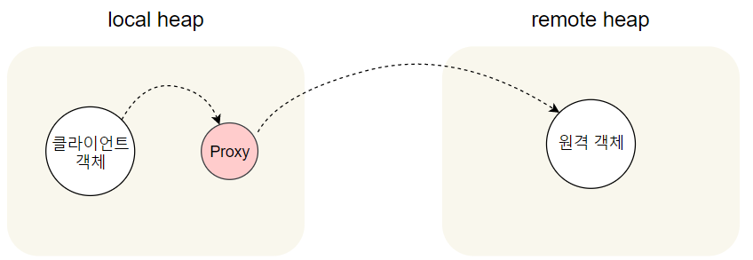
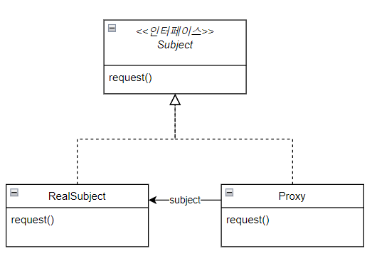
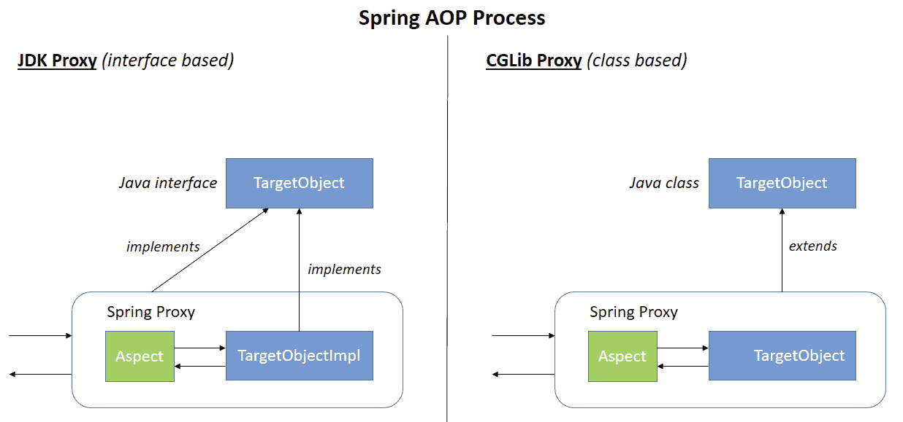
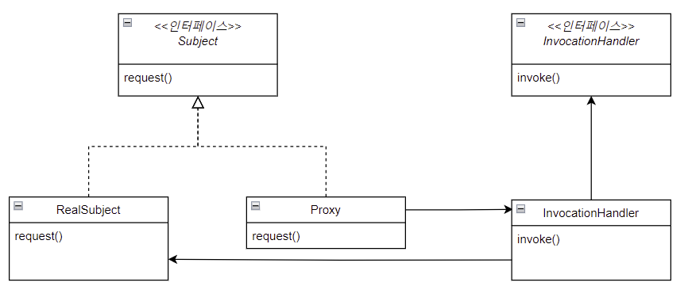

> spring aop 에서는 프록시를 사용한다고 한다. 
> 해당 프록시는 어떤식으로 동작하는지 궁금하여 오늘의 주제를 시작한다.
> 
> 작성 내용은 아래와 같다.
> - Proxy가 무엇인지
> - Weaving 이 무엇인지
>   - Weaving 3가지 방법에는 뭐가 있는지
> - Spring AOP에서는 어떤 Weaving을 사용하는지
>   - 그리고 해당 Weaving에는 무슨 방법이 있는지
>     - JDK Dynamic Proxy 는 활용 코드까지!

# Proxy란?

프록시(Proxy)는 대리자 라는 뜻으로, 
클라이언트가 사용하려고 하는 실제 대상인 것처럼 위장해서 클라이언트의 요청을 받아주는 역할을 한다.

> 대상 객체의 기능을 대신 수행하는 대리 객체를 사용하는 것이 프록시!

- 프록시가 실제 대상인 것처럼 위장 ➡️ 클라이언트는 구체 클래스를 알 필요가 없어짐
- 클라이언트의 요청을 받아서 원래 요청 대상에게 바로 넘겨주지 않고, 다양한 부가기능 지원 가능



# Proxy 패턴

특정 객체로의 접근을 제어하는 대리인(특정 객체를 대변하는 객체)을 제공



- Proxy와 RealSubject 모두 Subject 인터페이스를 구현 
  - ⇒ RealSubject 객체가 들어갈 자리면 Proxy를 대신 넣을 수 있음. 
  - →Proxy가 RealSubject로의 접근을 제어하는 역할을 해줄 수 있다
- RealSubject : 진짜 작업 처리하는 객체
- Proxy : 진짜 작업을 처리하는 객체의 레퍼런스를 가짐
  - 레퍼런스를 이용해 요청 전달

## 프록시에서 접근을 제어하는 방법
- 원격 프록시(Remote Proxy)를 써서 원격 객체로의 접근을 제어 가능
  - 일반적인 Spring 개발에서는 거의 사용하지 않음
- 가상 프록시(virtual proxy)를 써서 생성하기 힘든 자원으로의 접근을 제어 가능
  - ex. JPA의 Lazy Loading
    → 엔티티를 즉시 로딩하지 않고 프록시 객체로 대체한 뒤, 실제 접근 시 DB 쿼리 발생
     ```java
     Member member = em.find(Member.class, 1L);
     // 실제 DB 조회 없이 프록시 객체 반환
     member.getOrders(); // 이 때 쿼리 발생 (Lazy loading)
     ```
  - AOP (지연된 로직 주입)
    → 프록시 객체가 실제 로직(Advice 등)을 대신 실행
- 보호 프록시(protection proxy)를 써서 접근 권한이 필요한 자원으로의 접근을 제어 가능
  -  ex. Spring Security
     → 메서드 호출 전에 프록시가 인증/인가 검증 수행 후 실제 메서드 실행 여부 결정
     ```java
     @PreAuthorize("hasRole('ADMIN')")
     public void deleteUser(Long id) {  }
     ```


# 🌳 Weaving

Weaving은 Pointcut에 의해서 Advice(부가 기능)를 핵심 코드(타겟 객체)에 실제로 결합하는 과정이다.

Weaving에 대해서는 3가지 방법이 있고 언제 수행하느냐에 따라 Runtime, Load-time, Compile-time으로 나뉘게 된다.

| Weaving 시점       | 설명                                          | 사용 기술 예시                   |
| ---------------- | ------------------------------------------- | -------------------------- |
| **Compile-time** | 컴파일 시점에 Aspect를 클래스에 삽입                     | AspectJ (ajc 컴파일러 사용)      |
| **Load-time**    | 클래스 로딩 시점 (JVM에 올라갈 때) Aspect를 삽입           | AspectJ + Java Agent       |
| **Runtime**      | 런타임 시점에 프록시 객체를 만들어 Advice를 삽입 (Spring AOP) | JDK Dynamic Proxy, CGLIB |


# Spring AOP에서의 Weaving

> AOP 단어
> 
> - Advice: 공통 기능, 타겟에 제공할 부가기능을 담고 있는 모듈 (예: 로깅)
> 
> - Pointcut: 언제/어디에 적용할지 정의(어드바이스를 적용할 타겟의 메서드를 선별하는 정규표현식)
> 
> - Join Point: 어드바이스가 적용될 수 있는 위치
> 
> - Aspect: Advice + Pointcut의 묶음



- Spring AOP는 기본 Runtime Weaving(RTW)을 사용한다.
  - 실제 런타임시 Method 호출 시에 위빙이 이루어지는 방식이다.(애플리케이션 실행 도중에 프록시 객체를 만들어 부가기능을 결합)
- 두 가지 방법 중 하나를 사용한다.
  - 인터페이스 기반이면 → JDK Dynamic Proxy
  - 클래스 기반이면 → CGLIB (클래스 상속 방식)
  > → 즉, JDK Dynamic Proxy와 CGLIB 둘 다 Runtime Weaving 기술

## JDK Dynamic Proxy

- 타깃의 인터페이스를 기준으로 Proxy를 생성해준다.
  > JDK Dynamic Proxy: 리플렉션 패키지에 존재하는 Proxy라는 클래스를 통해 생성된 Proxy 객체
  > - java.lang.reflect.proxy 클래스 사용하여 생성
  - 인터페이스가 없으면 프록시가 생성 되지 않음
  - java.lang.reflect.proxy 클래스 사용하여 생성
- 개발자가 타깃에 대한 정보를 잘 못 주입할 경우를 대비하여 JDK Dynamic Proxy는 내부적으로 주입된 타깃에 대한 검증 코드를 형성하고 있다.
- Spring AOP default 값

> **동적 프록시(dynamic proxy)**
>
> 진짜 프록시는 실행 중에 생성된다고 동적 프록시라고 부른다.
>
> 
>
> - java.lang.reflect 패키지 안에 프록시 기능이 있다 
>   - 이 패키지를 사용하면 즉석에서 하나 이상의 인터페이스를 구현하고,
>   - 지정 클래스에 메소드 호출을 전달하는 클래스를 만들 수 있다.
> 
> - **자바에서 프록시 클래스를 생성하기에 프록시 클래스에게 무슨일을 해야하는지 알려 줄 방법 필요**
>   - ➡️ InvocationHandler 이용
>

### JDK Dynamic Proxy 코드
> #### 🌳 활용활 자바 표준 라이브러리
> 
> 1. java.lang.reflect.Proxy 클래스의 newProxyInstance
>    - 프록시를 생성해준다.
>    - Proxy 클래스가 런타임에 자동으로 생성해주는 프록시 클래스 내부에 InvocationHandler.invoke()를 직접 호출하는 코드를 작성한다.
>       ```java
>       @CallerSensitive
>       public static Object newProxyInstance(ClassLoader loader,
>           Class<?>[] interfaces,
>           InvocationHandler h) {
>         Objects.requireNonNull(h);
>    
>         @SuppressWarnings("removal")
>         final Class<?> caller = System.getSecurityManager() == null
>             ? null
>             : Reflection.getCallerClass();
>    
>         /*
>          * Look up or generate the designated proxy class and its constructor.
>          */
>         Constructor<?> cons = getProxyConstructor(caller, loader, interfaces);
>    
>         return newProxyInstance(caller, cons, h);
>       }
>    
>       private static Object newProxyInstance(Class<?> caller, // null if no SecurityManager
>           Constructor<?> cons,
>           InvocationHandler h) {
>         /*
>          * Invoke its constructor with the designated invocation handler.
>          */
>         try {
>           if (caller != null) {
>             checkNewProxyPermission(caller, cons.getDeclaringClass());
>           }
>    
>           return cons.newInstance(new Object[]{h});
>         } catch (IllegalAccessException | InstantiationException e) {
>           throw new InternalError(e.toString(), e);
>         } catch (InvocationTargetException e) {
>           Throwable t = e.getCause();
>           if (t instanceof RuntimeException) {
>             throw (RuntimeException) t;
>           } else {
>             throw new InternalError(t.toString(), t);
>           }
>         }
>       } 
>       ```
> 
> 2. java.lang.reflect.InvocationHandler 인터페이스
>    - 프록시 클래스에게 무슨일을 해야하는지 알려주어야 한다.
>    - InvocationHandler 는 프록시에 호출되는 모든 메소드에 응답한다.
>    - InvocationHandler가 RealSubject 객체에 있는 메소드로의 접근을 제어한다.
>    ```java
>    public interface InvocationHandler {
>      public Object invoke(Object proxy, Method method, Object[] args)
>      throws Throwable;
>    }
>    ```

1. 인터페이스
    ```java
    public interface Service {
        void serve();
    }
    ```
2. 실제 구현체
    ```java
    public class RealService implements Service {
        public void serve() {
            System.out.println("실제 서비스 로직");
        }
    }
    ```

3. InvocationHandler 구현
    
    ```java
    import java.lang.reflect.*;
    
    public class LoggingHandler implements InvocationHandler {
        private final Object target;
    
        public LoggingHandler(Object target) {
            this.target = target;
        }
    
        public Object invoke(Object proxy, Method method, Object[] args) throws Throwable {
            System.out.println("🔍 메서드 호출 전: " + method.getName());
            Object result = method.invoke(target, args);
            System.out.println("✅ 메서드 호출 후: " + method.getName());
            return result;
        }
    }
    ```

4. 프록시 생성
    ```java
    public class Main {
        public static void main(String[] args) {
            RealService realService = new RealService();
    
            Service proxyInstance = (Service) Proxy.newProxyInstance(
                    Service.class.getClassLoader(),
                    new Class[]{Service.class},
                    new LoggingHandler(realService)
            );
    
            proxyInstance.serve();  // 프록시를 통한 호출 ← invoke() 내부로 전달됨!
        }
    }
    ```

   - ✅ 내부적으로 생성되는 Proxy 클래스 구조(개념)
     - JVM이 `Proxy.newProxyInstance()` 호출 시 내부적으로 다음과 같은 코드를 가진 클래스를 바이트코드 수준에서 생성한다.
       ```java
       public final class $Proxy0 extends Proxy implements Service {
           public $Proxy0(InvocationHandler h) {
               super(h);
           }
    
           public void serve() {
               try {
                   Method m = Service.class.getMethod("serve");
                   h.invoke(this, m, null);  // ← 여기서 InvocationHandler 호출됨
               } catch (Throwable e) {
                   throw new RuntimeException(e);
               }
           }
       }
       ```
     * `h`: `Proxy` 부모 클래스가 가지고 있는 `InvocationHandler`
     * 메서드가 호출되면 하드코딩된 방식으로 `invoke()`로 전달
     * 이 코드는 실제로 바이트코드로 만들어지고 `sun.misc.ProxyGenerator`를 통해 JVM이 런타임에 로드합니다.
5. 출력
  ```
  🔍 메서드 호출 전: serve
  실제 서비스 로직 실행
  ✅ 메서드 호출 후: serve
  ```
> #### ✅ 확인해보기: Proxy 클래스 실제 바이트코드 저장해보기 (참고용)
> 
> ```java
> byte[] proxyClassBytes = ProxyGenerator.generateProxyClass("MyProxy", new Class[]{Service.class});
> Files.write(Paths.get("MyProxy.class"), proxyClassBytes);
> ```
> 
> 위 코드를 통해 Proxy 클래스의 실제 구현 내용을 바이트코드로 확인할 수도 있다고 한다.


## CGLib(Code Generator Library)

CGLib: 클래스의 바이트코드를 조작하여 Proxy 객체를 생성해주는 라이브러리

> Spring 3.2부터는 CGLIB이 스프링 코어에 포함
> ```java
> implementation 'cglib:cglib:{version}'
> ```

- 라이브러리를 사용하여 클래스 기반으로 프록시 생성

## JDK Proxy vs	CGLIB

### Spring AOP에서의 선택 기준

| 대상 클래스 유형                     | 사용되는 프록시 방식              |
| ----------------------------- | ------------------------ |
| 인터페이스 존재                      |  **JDK Dynamic Proxy** |
| 인터페이스가 없고 클래스만 있음             |  **CGLIB Proxy**       |
| `@EnableAspectJAutoProxy(proxyTargetClass = true)` 강제 설정 |  **CGLIB 강제 사용**       |

> proxyTargetClass 속성을 통해 CGLIB 프록시를 강제할 수 있다.
> 
> @EnableTransactionManagement(proxyTargetClass = true) or 
> 
> @EnableAspectJAutoProxy(proxyTargetClass = true)
>
>- **`proxyTargetClass = false` (기본값)**:
>- **인터페이스가 있는 경우**: JDK 동적 프록시 사용.
>  - **인터페이스가 없는 경우**: CGLIB 프록시 사용. JDK 동적 프록시로는 클래스를 프록싱할 수 없기 때문.
>- **`proxyTargetClass = true`**:
>    - 항상 CGLIB 프록시 사용, 인터페이스 여부와 무관.

### 성능 비교
| 항목     | JDK Proxy | CGLIB         |
| ------ | --------- | ------------- |
| 생성 속도  | 빠름        | 느림            |
| 실행 속도  | 약간 느림     | 약간 빠름         |
| 메모리 사용 | 적음        | 약간 많음         |
| 유연성    | 인터페이스 필요  | 클래스 기반으로 더 유연 |

