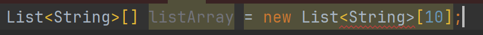

> 1. 제네릭이란 무엇이며 왜 사용하나요?
> 2. 제네릭을 사용하지 않은 코드와 비교해 설명해보세요.
> 3. 자바 제네릭은 컴파일 시점에만 동작한다는데, 무슨 의미인가요?
> 4. 와일드카드(?)란 무엇이고 언제 사용하나요?
> 5. 와일드카드의 extends 와 super 의 차이는 무엇인가요?
> 6. 제네릭 타입에 대해 타입 제한을 걸 수 있나요?
> 7. 제네릭 배열을 생성할 수 없는데, 왜 그런가요?
> 8. 공변 vs 불공변

# 1. 제네릭이란 무엇이며 왜 사용하나요?

자바에서 제네릭(Generics)은 클래스 내부에서 사용할 데이터 타입을 외부에서 지정하는 기법을 의미한다.

- 재사용성과 안정성
  - 제네릭을 사용하면 담을 수 있는 타입을 컴파일러에 알려주어 클래스나 인터페이스가 사용할 데이터 타입을 나중에 지정할 수 있다. 
    - 객체별로 다른 타입의 자료가 저장될 수 있도록 한다.
  - 이러면 컴파일러가 알아서 형변환 코드를 추가해주어 코드의 재사용성을 높이고 엉뚱한 타입 객체를 넣으려는 시도를 차단해 안정성 높은 프로그램을 만들어준다.

# 2. 제네릭을 사용하지 않은 코드와 비교해 설명해보세요.

제네릭을 지원하기 전에는 컬렉션에서 객체를 꺼낼 때 마다 형변환이 필요하고 이는 런타임에 형변환 오류가 뜰 수 있다.
반면 제네릭을 활용하면 타입 안정성을 확보할 수 있는데, 예를들어 ArrayList<String> 변수에 int 타입의 값을 add 하려고 하면 컴파일 오류가 발생한다. 
또한 해당 list에서 요소를 조회할 때마다 캐스팅도 불필요하여 편하다.(이는 컴파일러가 자동 형변환을 해주기 때문이다.)
```java
import java.util.ArrayList;
 
public class NonGenericExample {
    public static void main(String[] args) {
        // 비제네릭 컬렉션 생성
        ArrayList list = new ArrayList();
        
        // 컬렉션에 요소 추가
        list.add("Hello");
        list.add("World");
        list.add(123); // Integer도 추가 가능 (모든 객체가 가능)
 
        // 컬렉션에서 요소 꺼내기 (캐스팅 필요)
        String firstElement = (String) list.get(0);
        String secondElement = (String) list.get(1);
        Integer thirdElement = (Integer) list.get(2);
 
        // 출력
        System.out.println(firstElement); // Hello
        System.out.println(secondElement); // World
        System.out.println(thirdElement); // 123
    }
}
```
```java
import java.util.ArrayList;
 
public class GenericExample {
    public static void main(String[] args) {
        // 제네릭 컬렉션 생성
        ArrayList<String> list = new ArrayList<>();
 
        // 컬렉션에 요소 추가
        list.add("Hello");
        list.add("World");
        // list.add(123); // 컴파일 오류: String 타입만 허용
 
        // 컬렉션에서 요소 꺼내기 (캐스팅 불필요)
        String firstElement = list.get(0);
        String secondElement = list.get(1);
 
        // 출력
        System.out.println(firstElement); // Hello
        System.out.println(secondElement); // World
    }
}
```

# 3. 자바 제네릭은 컴파일 시점에만 동작한다는데, 무슨 의미인가요?

제네릭 타입 정보가 컴파일 시에만 사용되고, 런타임에는 사라진다는 의미다.

여기서 실체화라는 개념이 있는데 실체화(reify)라는 개념은 제네릭 타입이 런타임에도 타입 정보가 유지되는지와 관련이 있다.
배열은 런타임에도 자신이 담기로 한 원소 타입을 인지/확인 하기 때문에 실체화가 되는 타입이지만, 리스트는 원소 타입을 컴파일 타임에만 검사하고 런타임에는 알 수 없어 실체화가 되지 않는다고 말한다.

- 배열
  ```java
  int[] nums = new int[3];
  System.out.println(nums.getClass()); // class [I
  ```
  - 배열은 런타임에도 자신이 어떤 타입(int, String 등)의 배열인지 알고 있습니다.
- 리스트
  ```java
  List<String> a = new ArrayList<>();
  List<Integer> b = new ArrayList<>();
  
  System.out.println(a.getClass() == b.getClass()); // true
  ```
  - List<String>와 List<Integer>는 런타임에 똑같은 타입입니다: ArrayList
    - 제네릭 타입 정보가 런타임에 사라졌기 때문이다. (타입 소거)

# 4. 와일드카드(?)란 무엇이고 언제 사용하나요?

> - `<?>`: 비한정적 와일드카드 (Unbounded Wildcard)
>   - 특정 타입에 구애받지 않고 모든 타입을 수용할 수 있는 와일드카드
> 
> - `<T>`: 타입 파라미터 (Type Parameter)
>   - 메서드, 클래스 또는 인터페이스가 사용할 수 있는 특정 타입을 나타내는 기호
>   > - 여기서 T는 임의의 타입 이름 일반적으로 T는 Type의 약자다.
>   > - 상황에 따라 E(Element), K(Key), V(Value), N(Number) 등의 이름도 사용된다.

`<?>`는 컬렉션의 타입을 명시하지 않아 모든 타입을 수용하지만, 내부 요소의 타입을 알 수 없기 때문에 요소 추가 작업은 제한된다. 주로 읽기 전용 작업에 사용된다.
```java
public void printList(List<?> list) {
    for (Object element : list) {
        System.out.println(element);
    }
    // list.add("Hello");  // 컴파일 오류: 비한정적 와일드카드는 추가를 허용하지 않음
}
```

`<T>`는 특정 타입을 지정하며, 호출 시 구체적인 타입으로 대체된다. 타입 안전성을 유지하면서 읽기 및 쓰기 작업 모두에 사용할 수 있다.
```java
public <T> void printList(List<T> list) {
    for (T element : list) {
        System.out.println(element);
    }
    // list.add("Hello");  // 컴파일 오류: T가 String인지 알 수 없음
}
 
public <T> void addToList(List<T> list, T element) {
    list.add(element);
}
```
# 5. 와일드카드의 extends 와 super 의 차이는 무엇인가요?

? extends T: 읽기 전용, 생성(add) 불가, 가져오기(get) 가능
```java
public void pushAll(Iterable<? extends E> src){
    for(E e : src)
      push(e);
}
```
? super T: 쓰기 가능 (add), 읽을 땐 Object로 추론됨
```java
public void popAll(Collection<? super E> dst){
    while (!isEmpty())
      dst.add(pop());
}
```
> PECS 원칙: Producer Extends, Consumer Super
> 
> 입력 매개변수가 생산자와 소비자 역할을 동시에 한다면 와일드카드 타입을 써도 좋을 게 없다.
> 
> 매개변수화 타입 T가
> 
> 생산자라면 <? extends T>를 사용하고
> 
> 소비자라면 <? super T>를 사용한다.
> 
> > 여기서 생산자 소비자 이해하기
> > 
> > pushAll의 src 매개변수는 Stack이 사용할 E 인스턴스를 생산하므로 src의 적절한 타입은 Iterable<? extends E>
> > 
> > popAll의 dst 매개변수는 Stack으로부터 E 인스턴스를 소비하므로 dst의 적잘한 타입은 Collection<? super E>

# 6. 제네릭 타입에 대해 타입 제한을 걸 수 있나요?

제네릭 타입에 타입 제한을 거는 방법에는 upper bound(상한 제한), lower bound(하한 제한)이 있습니다.

1. 상한 제한 (Upper Bound)
   ```java
    class Box<T extends Number> { ... }
   ```
   - T는 Number 클래스 또는 그 하위 클래스만 가능
   - ex. `Box<Integer>`, `Box<Double>`는 가능하지만 `Box<String>`은 불가능
     ```java
     class Calculator<T extends Number> {
        public double add(T a, T b) {
           return a.doubleValue() + b.doubleValue();
        }
     }
     ```
2. 하한 제한 (Lower Bound) → 메서드 파라미터에서만 사용 가능
   ```java
   public void addToList(List<? super Integer> list) {
     list.add(42);
   }
   ```
   - List<? super Integer>: Integer나 그 상위 타입(Number, Object)만 가능
   - list.add(...)는 가능하지만, 꺼낼 때는 Object로만 추론됨
3. 다중 제한 (Multiple Bounds)
    ```java
    class MyClass<T extends Number & Comparable<T>> { ... }
    ```
   - T는 Number를 상속하고, `Comparable<T>`를 구현해야 함
   - 클래스는 하나만 올 수 있고, 나머지는 모두 인터페이스여야 함
     - 예: `T extends ClassName & Interface1 & Interface2`
   - Comparable<T>, Comparator<T>, Iterable<T>, Iterator<T> 등을 활용할 수 있다.

# 7. 제네릭 배열을 생성할 수 없는데, 왜 그런가요?

배열은 런타임에도 자신이 담는 타입을 알고 있어야 하므로, 타입을 알 수 없는 제네릭 배열은 만들 수 없다.

런타임에는 제네릭이 타입 소거가 된다. 때문에 제네릭 배열은 타입이 안전하지 않기 때문에(= 자바는 어떤 타입의 배열을 만들어야 할지 모름) 제네릭 배열을 생성할 수 없다.

= 제네릭은 런타임에 타입 정보가 지워지기 때문에, 자바는 타입 안전하지 않은 배열 생성을 금지한다.

- `new List<E>[]`: 컴파일 시 제네릭 배열 생성 오류
  

# 8. 공변(covariant) vs 불공변(invariant)

공변과 불공변은 배열과 리스트를 생각하면 된다.

배열은 변할 수 있고, 리스트는 변할 수 없다.

`List<Type1>`은 `List<Type2>`의 하위 타입도 상위 타입도 아니다. `List<Object>`에는 어떤 객체든 넣을 수 있지만, `List<String>`에는 문자열만 넣을 수 있다.

```java
Object[] objectArray = new Long[1]; // 공변
objectArray[0] ="타입 달라서 못 넣음"; // 런타임 에러 java.lang.ArrayStoreException: java.lang.String
 
List<Object> ol = new ArrayList<Long>(); // 불공변 컴파일 에러
```

[블로그](https://jepa.tistory.com/90#%EC%A0%9C%EB%84%A4%EB%A6%AD%20%EC%A7%80%EC%9B%90%20%EC%A0%84%EC%9D%98%20%EC%BB%AC%EB%A0%89%EC%85%98-1)