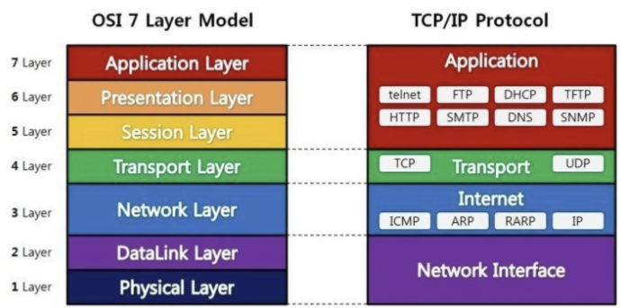
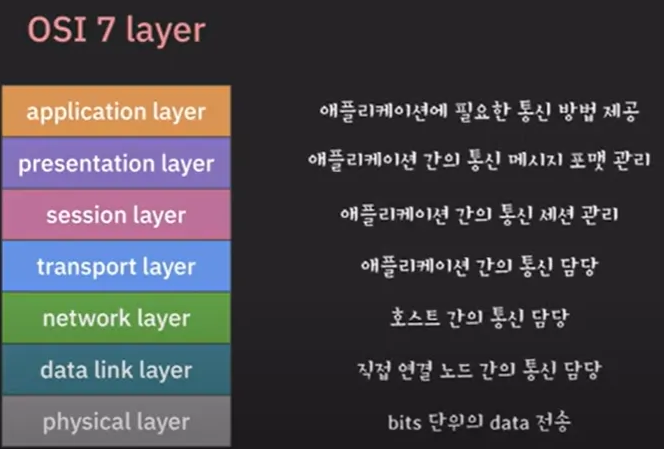
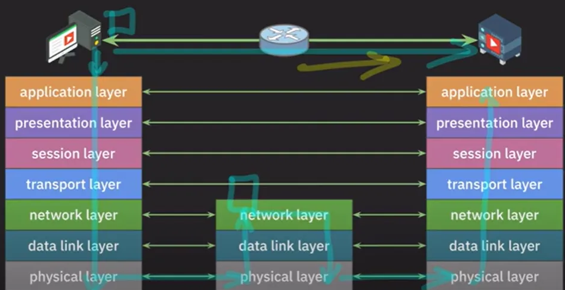
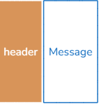
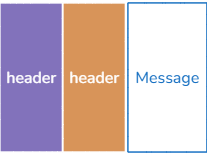
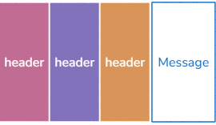
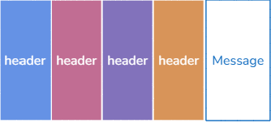
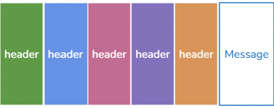
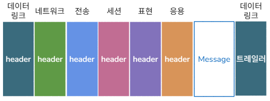

# OSI 7계층

OSI7 계층은 네트워크 통신이 일어나는 과정을 7단계로 나눈 것을 말한다.

7단계로 나눈 이유는 문제가 생겼을 때 단계별로 빠르게 파악하기 위함이다.

- 각 계층에 맞게 프로토콜이 세분화돼서 구현
- 각 계층의 프로토콜은 하의 레이어의 프로토콜이 제공하는 기능을 사용하여 동작
  > ex. 네트워크 레이어에서 구현된 프로토콜은 바로 그 `아래에 있는` 데이터 링크 레이어의 구현된 `프로토콜을 사용해서 자신의 기능을 구현`하게 된다
- 계층을 나눈 이유: 통신이 일어나는 과정이 `단계별로 파악`
   > ex. PC방에서 오버워치를 하는데 연결이 끊겼다.
   >
   >  어디에 문제가 있는지 확인하기 위해서
   >
   >  - 모든 PC가 문제가 있다면
   >    - 라우터의 문제(3계층 네트워크 계층)
   >    - 광랜을 제공하는 회사의 회선 문제(1계층 물리 계층)
   >  - 한 PC만 문제가 있고
   >    - 오버워치 소프트웨어에 문제가 있다면(7계층 어플리케이션 계층)
   >    - 오버워치 소프트웨어에 문제가 없고, 스위치에 문제가 있으면(2계층 데이터링크 계층)
   >
   >  있다고 판단해 다른 계층에 있는 장비나 소프트웨어를 건들이지 않는것이다.
  > 

각각의 레이어가 이런 기능들을 수행한다

실제로 이제 A 컴퓨터에서 B 컴퓨터로 데이터를 보낸다고 한다면 당연히 A 컴퓨터도 마찬가지로 각 레이어별로 프로토콜을 구현하고 있을 것이다.

사이에 통신을 해야 되는데 가운데 라우터가 하나 있다하면, 라우터는 통신을 할 수 있도록 만들어주는 장치인 거기 때문에 보통 3개의 레이어에 있는 프로토콜을 구현을 하고 있다.

실제로 이렇게 두 컴퓨터 사이에서 통신을 한다고 했을 때 각 레이어별로 아래 그림과 같은 방식으로 통신이 된다.

1. 왼쪽 컴퓨터부터 메시지 하나를 이쪽으로 보낸다고 했을 때, 가장 위에 있는 어플리케이션 레이어부터 시작을 한다.
2. 위에서부터 아래로 쭉 내려오면서 계속 포장이 된다.
3. 각각의 레이어별로 그 네트워크의 기능을 수행하기 위해서 여러가지 처리를 해준 뒤에 하나하나씩 포장이 된다. 
4. 최종적으로 Physical Layer까지 내려왔으면 데이터를 보낸다(라우터로 이동).
5. 라우터는 포장지를 하나하나 뜯어서 이제 네트워크레이어까지 올리고, 네트워크레이어에서는 목적지 주소로 가려면 어디로 가야 되는지를 알려주는 역할을 한다. 
6. 최종적으로 목적지에 도착할 수 있도록 만들어주는 역할을 하는 것이 이 네트워크레이어이기 때문에 데이터에 있는 목적지 IP 주소를 확인을 한다. 
7. 이 데이터를 다시 또 포장을 쭉 시켜 피지컬 레이어까지 내려주고 데이터를 보낸다.
8. 그러면 다시 이제 차례차례 포장지를 다 뜯고 
9. 최종적으로 도착 컴퓨터의 어플리케이션 레이어까지 올라온다. 
10. 여기서 마침내 보내려고 했던 그 데이터를 이 어플리케이션이 받을 수 있게 된다.

## 사례
유튜브를 보다 댓글을 하나 쓴다. 댓글이 실제로 유튜브 서버까지 어떻게 가는지 살펴보자.

1. 먼저 이 어플리케이션 레이어에서 이 메시지를 보내기 위해서 이런저런 처리를 한다. 
   - 
   - 그렇게 해서 발생한 부가적인 정보를 어플리케이션 헤더에 담는다.
   - 
2. 그리고 나서 전체를 하나로 묶어서 데이터를 프레젠테이션 레이어로 보낸다.
3. 프레젠테이션 레이어에서도 처리를 한 다음, 관련된 부가적인 정보들을 헤더에 담아서 전체 데이터를 세션레이어로 내려준다.
   - 
4. 세션 레이어에서도 마찬가지로 자신의 기능에 맞는 처리를 해준 다음에, 그와 관련된 정보들을 세션 레이어의 헤더에 담고, 전달받은 데이터와 이 헤더를 합쳐 전체 데이터를 전송 레이어로 내려준다.
   - 
5. 전송 레이어는 실제로 어플리케이션 간의 데이터 통신을 담당하기 때문에 목적지 어플리케이션까지 데이터를 보내기 위해서 필요한 여러 정보들을 트랜스포트 레이어헤더에 담는다. 그리고 나서 아까 위에서 받았던 이 데이터와 이 트랜스포트 레이어의 헤더를 합쳐 전체 데이터를 이제 네트워크레이어로 내려준다.
   - 
6. 네트워크레이어는 어플리케이션들을 실행하고 있는 호스트들 사이에서의 통신을 담당하기 때문에 복잡한 네트워크에서 어떻게 목적지 호스트로 데이터를 보낼 것인지 해결해 줘야 된다. 
   - 이를 위해 목적지 IP 주소를 확인을 하고, IP 주소를 바탕으로 현재 내 기준에서 어디로 데이터를 보내야 되는지를 결정을 해주게 된다.
7. 연결된 라우터를 찾고 라우터로 데이터를 보내서 목적지까지 도착하려면 또 어디로 가면 되는지 확인을 하는 식으로 동작. 
8. 이와 관련된 여러가지 정보들을 모아서 네트워크레이어의 헤더에 담는다. 
   - 위에서 받았던 데이터와 해당 네트워크레이어의 헤더를 합쳐 데이터를 데이터 링크 레이어로 내려준다.
     - 
9. 데이터 링크 레이어에서는 둘(컴퓨터, 라우터 등 연결 경로) 사이에서 데이터를 보내기 위한 준비를 하고 그와 관련된 정보들을 데이터 링크 레이어의 헤더와 또 데이터 링크 레이어의 `트레일러`에 담는다. 
   - 이 트레일러 같은 경우에는 전송 후에 에러가 없었는지를 확인하는 용도로 사용. 
10. 헤더와 트레일러를 만든 뒤에 위 레이어에서 받았던 이 데이터와 합쳐서 최종적으로 이 데이터를 물리 레이어로 내려준다.
    - 
11. 피지컬 레이어는 데이터를 비트 단위로 라우터로 전송
12. 라우터에서 데이터를 아래 모습으로 만들어 준 뒤에 이제 이 데이터를 데이터 링크 레이어로 올려줍니다.
    - 
13. 데이터 링크 레이어에서는 레이어의 헤더와 트레일러를 확인해서 처리를 하고 문제가 없으면 얘네들은 이제 떼어낸 다음
    - 
    - 남아있는 이 데이터를 네트워크레이어로 올려주게 됩니다.
14. 네트워크레이어에서는 전송받은 데이터가 목적지 주소로 가기 위해서 어디로 가야 되는지를 판단을 해줘야 된다. 
    - 그러면 네트워크레이어의 헤더에 이 목적지 IP 주소가 있기 때문에 해당 정보를 바탕으로 가려면 어디로 가면 되는지를 확인
    - 다음으로 이동해야 되는 노드를 확인하고 헤더에서 일부 고쳐 줘야 될 정보들은 고쳐준 뒤 다시 이 데이터를 데이터 링크 레이어로 내려준다.
15. 데이터 링크 레이어에서는 두 노드 사이의 통신을 담당하게 되고 필요한 정보들을 헤더와 트레일러에 담은 뒤에 원래 이 데이터와 합쳐 전체 데이터를 피지컬 레이어로 내려준다.
    - 
16. 피지컬 레이어는 데이터를 비트 단위로 다음 라우터로 전송
    - 이후 12~15를 반복 후, 목적지로 전송
17. 목적지의 피지컬 레이어에서는 전달받은 픽셀 단위의 로우 데이터를 그림과 같은 형태로 만들어서 데이터를 데이터 링크 레이어로 올려줍니다.
18. 데이터 링크 레이어에서는 헤더와 트레일러를 확인해서 처리를 하고 문제가 없었으면 각각을 떼어내서 나머지 데이터만 추출을 한 뒤에 데이터를 네트워크레이어로 준다.
    - 
19. 네트워크레이어에서는 이 IP 헤더를 확인했는데 이제 자기 자신에게 도착을 했으니까, 즉 목적지에 도착을 했으니까 이제 필요한 처리를 한 뒤에 이제 이 헤더를 떼어내고 이 데이터를 트랜스포트 레이어로 올려줍니다.
    - 
20. 트랜스포트 레이어에서는 어플리케이션 간의 데이터를 전달하기 때문에 이 트랜스포트 레이어의 헤더를 참고해서 어떤 데이터를 전달하면 되는지를 판단
    - 유튜브 서버 어플리케이션으로 전달하면 되는 거구나. 
    - 확인이 되면 이제 이 어플리케이션의 데이터를 전달하기 위해 헤더는 떼어내고 이 데이터를 세션 레이어로 올려주게 됩니다.
    - 
21. 세션 레이어에서도 헤더에 있는 정보를 바탕으로 이런 저런 처리를 해준 뒤에 이제 헤더는 떼어내고 이 데이터를 프레젠테이션 레이어로 올리게 되고요.
    -  
22. 프레젠테이션 레이어에서는 이 헤더에 있는 정보를 바탕으로 처리를 해준 뒤 헤더는 떼어내고 남아있는 이 데이터를 어플리케이션 레이어로 올려주게 됩니다.
    - 
23. 어플리케이션 레이어에서는 이 헤더에 있는 정보를 바탕으로 처리를 해준 뒤 최종적으로  처음에 보냈던 데이터를 받게 되는 거죠.
    - 
    

그래서 어플리케이션의 메시지가 다른 어플리케이션에 도달할 때까지 어떤 과정을 거쳤는지 OSI 모델 관점에서 살펴보면 아래와 같이 진행이 된 것이다.

결국 이 과정을 살펴보면 보내는 쪽에서 데이터를 계속해서 포장을 시키고, 
그래서 데이터가 전달이 된 다음 포장을 좀 풀어서 다음으로는 어디로 가야 되는지 확인하고 
다시 포장을 한 다음에 이 쪽으로 보내고, 그리고 최종적으로 여기서 이렇게 포장을 다 풀어서 
원래 보내려고 했던 이 데이터를 받게 되는 이런 과정을 거치게 된다.

그리고 이 모든 과정 속에서 각각의 레이어마다 동작하는 프로토콜이 각자의 기능을 수행을 했다.

> 여기서 일련에 이런 과정들 포장을 했다가 포장을 풀었다가 하는 이런 과정을 뭐라고 하냐면,
> 
> encapsulation, decapsulation이라고 한다. 
> 
> 그래서 문서를 보다 이런 용어를 만나게 되면 다 이게 이런 것들을 의미를 하는 거구나 생각을 하면 된다.