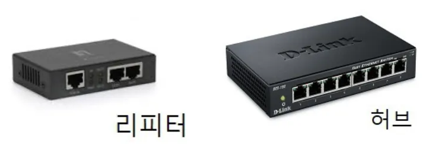
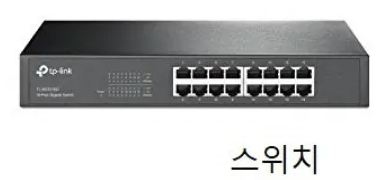

# OSI 7계층

저번 시간에는 전체적인 통신흐름에 대하 알아보았고 이번 시간에는 각 계층에 대해 알아보자.

## 1계층 - 물리계층(Physical Layer)

실제 어떤 물리적인 매개체를 통한 케이블일 수도 있고 무선의 신호일 수 있는 **매개체를 통해 실제로 데이터를 비트 단위로 전송을 하는 역할**을 수행한다. 

전기적, 기계적, 기능적인 특성을 이용해 `통신 케이블`로 데이터를 전송한다.

- 통신단위: `bit` (1,0으로 나타냄(전기 on off))
- 목적: 데이터 전기적 신호로 변환 후 통신(= 전달 및 수신만을 위함)
  - 실제 노드에서 노드로 데이터가 이동하게 됨.
- 데이터가 무엇인지, 어떤 에러가 있는지 등에는 전혀 신경 쓰지 않는다.
- 장비: 통신 케이블, 리피터, 허브
  - 

## 2계층 - 데이터 링크계층(DataLink Layer)

물리계층을 통해 송수신되는 **정보의 오류와 흐름을 관리**하여 안전한 **정보의 전달을 수행**할 수 있도록 도와준다.

네트워크계층은 IP 주소로 동작을 하지만,
데이터 링크 계층에서 장치와 장치 사이에 데이터를 주고 받을 때는 IP 주소 기반이 아닌 MAC 주소 기반으로 통신한다.

> 이때 IP 주소를 맥주소로 변환할 때 사용되는 프로토콜이 `ARP 프로토콜`

맥주소로 변환이 되면 그 주소를 바탕으로 하나의 노드에서 다음 노드로 데이터를 보낼 수 있게 된다.

- 목적: 직접 연결된 노드 간의 통신을 담당
  - 오류 찾기 기능, 재전송 기능 → 안전한 정보 전달
- 단위: `프레임`
- `MAC 주소`를 가지고 통신
  > MAC 주소
  > 
  > - 하드웨어 네트워크 주소, 네트워크 인터페이스에 부여된 고유한 식별자
  > - 주소 값은 물리적으로 할당 받는데, 이는 네트워크 카드가 만들어질 때부터 맥 주소(MAC address)가 정해져 있다는 뜻이다.
  > - 주소 체계는 계층이 없는 단일 구조
  > - vs IP 주소
  >   - 
  >   | 항목           | **MAC 주소**                      | **IP 주소**                                  |
  >   |--------------|---------------------------------|--------------------------------------------|
  >   | **역할**       | 물리적인 장치의 고유 식별자 (하드웨어 주소)       | 네트워크 상에서의 논리적 위치 표시 (소프트웨어 주소)             |
  >   | **계층**       | OSI 2계층 (데이터 링크 계층)             | OSI 3계층 (네트워크 계층)                          |
  >   | **고유성**      | 전 세계에서 중복되지 않도록 제조사가 부여         | 네트워크 상황에 따라 중복될 수도 있음 (동적으로 할당됨)           |
  >   | **변경 가능 여부** | 일반적으로 고정 (일부 설정으로 변경 가능)        | 일반적으로 변경 가능 (고정 IP 또는 DHCP로 할당)            |
  >   | **형식 예시**    | `00:1A:2B:3C:4D:5E` (16진수 12자리) | `192.168.0.1` (IPv4), `2001:db8::1` (IPv6) |
  >   | **사용 목적**    | 같은 네트워크(LAN) 내에서 장치 식별 및 데이터 전송 | 전 세계 어디서든 인터넷/네트워크 라우팅에 사용                 |
  >   | **구조**       | 계층적이지 않음 (Flat 구조)              | 계층적 구조                                     |

- 장비: 브리지, 스위치
  - 
  - 장비에서 MAC주소를 사용

    → **브릿지나 스위치를 통해 맥주소를 가지고 물리계층에서 받은 정보를 전달**

- 특징
  - 포인트 투 포인트(Point to Point) 간 `신뢰성있는 전송`을 보장하기 위한 계층
    - 때문에 CRC 기반의 `오류 제어와 흐름 제어`가 필요
  - 네트워크 `위의 개체들 간 데이터를 전달`하고, 물리 계층에서 발생할 수 있는 `오류를 찾아` 내고, `수정`하는 데 필요한 기능적, 절차적 수단을 제공
- 가장 잘 알려진 예
  - 이더넷
  - HDLC나 ADCCP 같은 포인트 투 포인트(point-to-point) 프로토콜
  - 패킷 스위칭 네트워크나 LLC, ALOHA 같은 근거리 네트워크용 프로토콜

## 3계층 - 네트워크 계층(Network Layer)

- 역할
  - 호스트 간의 통신을 담당
    - 목적지 호스트로 데이터를 전송하는 역할(어플리케이션으로 데이터를 보내려면 호스트로 데이터를 보내야 된다.)
      - 이때, 목적지 호스트의 IP 주소를 활용해서 데이터를 전송한다.
    - 실제로 데이터를 목적지까지 보내기 위해 네트워크를 이루고 있는 라우터 같은 장치들도 네트워크계층의 기능 구현 필요 
      > 목적지로 찾아갈 수 있게 하기위해 네트워크계층에 존재하는 대표적인 프로토콜이 `IP 프로토콜` 
      >
      > - IP 프로토콜
      >   - TCP/IP 기반의 `인터넷 망을 통하여` `데이타그램의 전달을 담당`하는 프로토콜
      > 
      >   1. 주요 기능
      >      - IP 계층에서 IP 패킷의 라우팅 대상이 됨 (Routing)
      >      - IP 주소 지정 (Addressing)
      >   2. 주요 특징
      > 
      >       | 특징                                   | 설명                                                                                                                                         |
      >       |--------------------------------------|--------------------------------------------------------------------------------------------------------------------------------------------|
      >       | 1. **비연결성 (Connectionless)**         | 데이터를 보내기 전에 연결을 설정하지 않음.(`비연결성` 데이터그램 방식으로 전달) 각 패킷은 독립적으로 전송됨.                                                                            |
      >       | 2. **비신뢰성 (Unreliable)**             | 전송 성공을 보장하지 않음. 손실, 중복, 순서 변경이 발생할 수 있음.                                                                                                   |
      >       | 3. **최선형 전달 (Best-effort Delivery)** | 가능하면 목적지까지 전달하지만, 보장을 하지 않음.(신뢰성(에러제어) 및 흐름제어 기능이 전혀 없음)  오류 발생 시 재전송은 상위 계층(TCP 등)에 맡김. 즉, 신뢰성을 확보하려면 IP 계층 위의 `TCP와 같은 상위 전송 계층에 의존` |
      >       | 4. **패킷 단위 전송**                      | 데이터를 **패킷(Packet)** 단위로 분할하여 전송. 각 패킷은 독립적으로 라우팅됨. (IP 패킷 구성(1. 헤더(Header): 메타데이터 (어디서 왔는지, 어디로 가는지 등) / 2. 데이터(Data): 실제 전송할 내용))         |
      >       | 5. **계층적 주소 지정**                     | IP 주소는 네트워크 + 호스트로 구성된 **계층적 구조**, 라우팅 효율성 향상                                                                                              |
      >       | 6. **라우팅 기능**                        | 패킷은 목적지까지 **라우터**를 거쳐 이동하며, 각 라우터는 목적지 주소 기반으로 다음 경로를 결정함                                                                                  |
      >       | 7. Big-endian (네트워크 바이트 순서)          | IP 헤더의 모든 필드는 "네트워크 바이트 순서(Network Byte Order)", 즉 Big-endian 방식으로 전송  - Big-endian: 상위 바이트(MSB)를 먼저 보내는 방식                             |
      >     - `경우에따라, 단편화가 필요` → `IP 단편화 참조`
      >     - TCP, UDP, ICMP, IGMP 등이 `IP 데이타그램에 실려서 전송`

  - 네트워크간의 최적의 경로 결정
    - 평소에 최적의 경로를 찾아 놓으면 데이터를 보낼 일이 생길 때 해당 경로를 바탕으로 목적지 호스트로 데이터를 보낼 수 있게 한다.
    - 여기서 네트워크 계층은 전체적인 경로를 담당
      - 각각의 노드 사이에서 어떻게 데이터를 전송할 것인가 이 부분은 관심사가 아님
        - 이 역할을 수행하는 것이 바로 아래에 데이터 링크 계층이 수행한다.(네트워크계층은 데이터 링크 계층이 제공하는 기능을 사용해서 목적지까지 데이터를 보내는 일을 수행 = 네트워크계층도 아래 계층이 제공하는 기능을 사용해서 자신의 기능을 구현)
    - 데이터를 목적지까지 가장 안전하고 빠르게 전달하는 기능(라우팅)
- 목적: 경로를 선택하고 주소를 정하고 `경로에 따라 패킷 전달`
- 장비: `라우터, Layer 스위치 3`(요즘은 2계층의 장비 중 스위치 장비에 라우팅 기능을 장착한 Layer 3 스위치도 있다.)
  - 라우터가 이 계층에서 동작하고 이 계층에서 동작하는 스위치도 있다.
  - `IP 주소`를 사용
    - 논리적인 주소 구조(IP)

      `네트워크 관리자가 직접 주소를 할당`하는 구조를 가지며, `계층적`(hierarchical)이다.

    - IP 계층
      - IP 패킷의 전달 및 라우팅을 담당하는 계층
      - 역할
        - IP 계층에서는 그 하위계층인 데이터링크 계층의 하드웨어적인 특성에(즉, ATM 이 든 Frame Relay 이든 상관없이) 관계없이 `독립적인 역할을 수행`
        - OSI 7계층모델에서 `IP 계층은 네트워크계층에 해당`
          - 즉, `패킷`을 목적지까지 `전달`하는 역할 및 `그에 수반되는 기타 역할`을 함
      - IP 계층 상에 있는 주요 프로토콜
        - 패킷의 전달을 책임지는 IP
        - 패킷 전달 에러의 보고 및 진단을 위한 ICMP
        - 복잡한 네트워크에서 인터네트워킹을 위한 경로를 찾게해주는 라우팅 프로토콜

- 특징
  - 여기에 사용되는 프로토콜의 종류도 다양하고, 라우팅하는 기술도 다양
  - 여러개의 노드를 거칠때마다 `경로를 찾아`주는 역할
  - `다양한 길이의 데이터`를 네트워크들을 통해 전달하고, 그 과정에서 `전송 계층이 요구하는 서비스 품질(QoS)을 제공`하기 위한 기능적, 절차적 수단을 제공
  - 라우팅, 흐름 제어, 세그멘테이션(segmentation/desegmentation), 오류 제어, 인터네트워킹(Internetworking) 등을 수행
  - 데이터를 연결하는 `다른 네트워크를 통해 전달`함으로써 `인터넷이 가능하게 만드는 계층`
  - 서브네트의 최상위 계층으로 경로를 설정하고, 청구 정보를 관리
  - 개방형 시스템들의 사이에서 네트워크 연결을 설정, 유지, 해제하는 기능을 부여하고, `전송 계층 사이에 네트워크 서비스 데이터 유닛`(NSDU : Network Service Data Unit)`을 교환`하는 기능을 제공

## 4계층 - 전송 계층(Transport Layer)

어플리케이션 간의 통신을 담당

이 계층에서는 실제로 목적지 어플리케이션으로 데이터를 전송한다.

> 어플리케이션으로 데이터를 보낼 때, 어떻게 데이터를 보낼 것인가와 관련해서 두 가지 중요한 프로토콜이 있다.
> 
> 1. TCP 프로토콜
>    - 안정적이고 신뢰할 수 있는 방식으로 데이터를 전송하는, 그래서 데이터가 전송되는 것을 보장하는 프로토콜
> 2. UDP
>    - 데이터가 중간에 유실될 수도 있고, 데이터를 보는 순서대로 받는 쪽에서 받지 못할 수도 있지만, 어쨌든 해당하는 어플리케이션으로 데이터를 보낼 수 있는 프로토콜

- 목적지 어플리케이션의 데이터를 전송하기 위해서 어떤 식의 통신을 할 것이냐 이것을 결정하는 계층
  - 실제 보내려는 데이터가 어떻게 목적지까지 찾아가게 만들 것인지에 대한 것은 관심사가 아님
  - 이 목적지까지 찾아가게 만드는 이 기능은 바로 아래에 있는 네트워크계층이 담당하는 기능
  - 전송 계층은 그 기능을 사용해서 실제로 어떤 방식으로 어플리케이션까지 데이터를 전달할 것이냐 를 구현하고 또 담당하는 계층
- 목적: `통신 활성화`
  - 보통 `TCP프로토콜을 이용`하며, `포트를 열어`서 응용프로그램들이 전송을 할 수 있게 한다.
  - 데이터가 왔다면 4계층에서 해당 `데이터를 하나로 합쳐서 5계층에 전달`
- **특징**
  - 종단간(end-to-end) 통신: 송신 측 애플리케이션 ↔ 수신 측 애플리케이션 사이의 연결을 직접 담당
  - 포트 번호 사용: 프로세스(프로그램)를 구분하기 위해 포트 번호를 사용 (예: HTTP(80), HTTPS(443))

  → 전송 계층이 `패킷들의 전송이 유효한지 확인`하고 전송 `실패한 패킷들을 다시 전송`한다는 것을 뜻함

  - 전송 계층(Transport layer)은 양 끝단(End to end)의 사용자들이 `신뢰성있는 데이터`를 주고 받을 수 있도록 해 주어, 상위 계층들이 데이터 전달의 유효성이나 효율성을 생각하지 않도록 해준다.
  - 기능은 `오류검출 및 복구와 흐름제어, 중복검사 등을 수행`한다.
- 가장 잘 알려진 전송 계층: TCP이다.
  > - **TCP 프로토콜(Transmission Control Protocol)**
  >   - OSI 계층모델의 관점에서 `전송 계층(4계층)에 해당`
  >   - 목적: 양종단 호스트 내 프로세스 상호 간에 `신뢰`적인 `연결지향성 서비스`를 제공
  >     - IP의 비신뢰적인 최선형 서비스에다가 `신뢰적인 연결지향성 서비스를 제공`하게 됨
  > 
  >     **→ 신뢰적인 전송을 보장**함으로써, 어플리케이션 구현이 한층 쉬워지게 됨
  > 
  >   - 특징
  >     1. `신뢰성` 있음 (Reliable)
  >        - `패킷 손실, 중복, 순서바뀜 등이 없`도록 보장
  >        - TCP 하위계층인 IP 계층의 신뢰성 없는 서비스에 대해 신뢰성을 제공
  >     2. 연결지향적 (Connection-oriented)
  >        - 같은 전송계층의 UDP가 비연결성(connectionless)인 것과는 달리, TCP는 연결지향적 임
  >        - 이 경우, `느슨한 연결(Loosly Connected)`을 갖으므로 강한 연결을 의미하는 가상회선이라는 표현 보다는 오히려 연결지향적이라고 말함
  >        - 연결 관리: TCP `연결설정 및 연결해제 필요`
  >        - 양단간 어플리케이션/프로세스는 TCP가 제공하는 `연결성 회선을 통하여 서로 통신`
  >     3. 헤더
  >        - 16 비트의 포트 번호를 사용
  > 
  > - **UDP 프로토콜(User Datagram Protocol)**
  >   - 전송 계층의 통신 프로토콜의 하나 (TCP에 대비됨)
  >   - **신뢰성이 낮은 프로토콜**로써 완전성을 보증하지 않으나, `가상회선을 굳이 확립할 필요가 없`고 `유연하며 효율적 응용의 데이타 전송`에 사용
  >   - 특징
  >     1. `비연결성`이고, `신뢰성이 없`으며, `순서화되지 않`은 Datagram 서비스 제공**
  >        - 메세지가 제대로 도착했는지 확인하지 않음 (확인응답 없음)
  >        - 수신된 메세지의 순서를 맞추지 않음 (순서제어 없음)
  >        - 흐름 제어를 위한 피드백을 제공하지 않음 (흐름제어 없음)
  >        - 검사합을 제외한 특별한 오류 검출 및 제어 없음 (오류제어 거의 없음)
  >        - UDP를 `사용하는 프로그램 쪽에서 오류제어 기능을 스스로 갖추어야 함`
  >        - 데이터그램 지향의 전송계층용 프로토콜 (논리적인 가상회선 연결이 필요없음)
  >        - 비연결접속상태 하에서 통신
  >     2. 실시간 응용 및 **멀티캐스팅** 가능
  >        - 빠른 요청과 응답이 필요한 `실시간 응용에 적합`
  >        - 여러 `다수 지점에 전송` 가능 (1:多)
  >     3. `헤더가 단순
  >        - UDP는 TCP 처럼 `16 비트의 포트 번호를 사용`
  >        - `헤더는 고정크기의 8 바이트`(TCP는 20 바이트) 만 사용
  >        - 즉, 헤더 처리에 많은 시간과 노력을 요하지 않음

5~7계층은 어플리케이션과 관련된 기능을 담당

## 5계층 -세션 계층(Session Layer)

어플리케이션 간의 통신에서 세션을 관리하는 계층

- RPC(remote procedure call)
  - RPC가 이 세션 계층에서 동작한다고 보면 된다.

데이터가 통신하기 위한 논리적인 연결을 담당(통신을 하기위한 대문이라 보면 된다.)

- 목적: 한 세션에서 양 끝단의 서로 다른 두 `애플리케이션 간의 네트워크 조정을 담당`(통신을 관리하기 위한 방법을 제공)
  - 세션은 일대일 애플리케이션 연결 및 동기화 충돌의 시작과 끝을 관리
    - 세션 계층에서 일반적으로 사용되는 프로토콜: [네트워크 파일 시스템(NFS)과 서버 메시지 블록(SMB)](https://aws.amazon.com/compare/the-difference-between-nfs-smb/)
  - `세션 설정, 유지, 종료, 전송 중단시 복구` 등의 기능이 있다.
  - `TCP/IP 세션을 만들고 없애`는 책임을 진다.
  - 동시 송수신 방식(duplex), 반이중 방식(half-duplex), 전이중 방식(Full Duplex)의 통신과 함께, 체크 포인팅과 유휴, 종료, 다시 시작 과정 등을 수행

- 4계층에서도 연결을 맺고 종료할 수 있기 때문에 우리가 어느 계층에서 통신이 끊어 졌나 판단하기는 한계가 있으므로 세션 계층은 `4 계층과 무관하게 응용 프로그램 관점`에서 봐야 한다.
  > OSI 4계층 (전송 계층, TCP 등) 은 클라이언트와 서버 간에 논리적 연결(세션) 을 만들고 끊을 수 있다.  예를 들어 TCP는 3-way handshake로 연결을 만들고, FIN으로 종료한다.
  > 
  > 사용자가 화상회의를 진행할 때, TCP 연결이 끊겼다고 해서 회의 자체(세션)가 종료 되었다고 판단하진 않는다. 이때 세션 계층은 "회의 전체 세션"을 관리하며, 중간 연결이 끊겨도 다시 이어서 할 수 있게 관리해주는 역할을 하는 것이다. 
- 통신하는 사용자들을 동기화하고 오류복구 명령들을 일괄적으로 다룬다.
- 통신을 하기 위한 세션을 확립/유지/중단 (운영체제가 해줌)

## 6계층 - 표현 계층(Presentation Layer)

어플리케이션 간의 통신에서 메시지 포맷을 관리하는 계층

- 어떤 캐릭터셋으로 `인코딩` 했는지에 따라서 받는 쪽에서는 그 캐릭터셋으로 `디코딩`을 해줘야 함
- 보내는 쪽에서 보안 이슈로 `암호화`를 해서 보냈다면, 받는 쪽에서는 그 암호화된 데이터를 `복호화`를 해서 다시 읽을 수 있도록 만들어 줘야 한다.
- 보내는 쪽에서 데이터를 `압축`해서 보냈다면, 받는 쪽에서는 `압축을 풀어`야만 원래의 데이터를 볼 수가 있다.

- 즉, 어플리케이션 간의 통신에서 메시지 포맷을 관리하는 계층이다.

`데이터 표현이 상이한 응용 프로세스의 독립성을 제공`하고, `암호화` 한다.

- 목적: `코드 간의 번역`을 담당
  - 사용자 시스템에서 데이터의 형식상 차이를 다루는 부담을 응용 계층으로부터 덜어 준다.
- 특징
  - `MIME 인코딩`이나 `암호화` 등의 동작이 이 계층에서 이루어진다.

    > 예를 들면, EBCDIC로 인코딩된 문서 파일을 ASCII로 인코딩된 파일로 바꿔 주는 것,
    해당 데이터가 TEXT인지, 그림인지, GIF인지 JPG인지의 구분 등이 표현 계층의 몫이다.

사용자의 명령어를 완성 및 결과를 표현. (포장/압축/암호화)

## 7계층 - 응용 계층(Application Layer)

어플리케이션 목적에 맞는 통신 방법을 제공

어플리케이션 간의 통신 방법을 결정하는 계층이기 때문에, 실제로 어떻게 데이터가 오고 가게 만들 것인지는 응용 계층의 관심사가 아니다. 

실제로 어떻게 데이터를 보낼 것인가는 그 아래 계층 어딘가에서 구현하는 기능이고, 그 기능을 응용계층은 사용만 한다.

- 최종 목적지
- 프로토콜: HTTP, DNS, FTP, SMTP, POP3, IMAP, Telnet 등
  - 예시
    - 어플리케이션과 통신을 통해서 사용자에게 **웹페이지**를 보여주고 싶다면 그때는 두 어플리케이션이 HTTP 프로토콜 사용해서 통신
    - **파일을 서버에 업로드하고 또 다운로드 하는 어플리케이션**을 만들고 싶다면 FTP라는 프로토콜을 사용
    - 유튜브닷컴처럼 이런 **도메인을 IP 주소로 바꾸고** 싶다면 DNS라는 프로토콜을 사용
    - **이메일**을 주고받는 기능을 구현하고 싶다면, 그때는 SMTP 프로토콜

  > - HTTP 프로토콜(HyperText Transfer Protocol)
  > 
  >   웹 상에서 웹 서버 및 웹브라우저 상호 간의 데이터 전송을 위한 응용계층 프로토콜
  > 
  >   처음에는, WWW 상의 하이퍼텍스트 형태의 문서를 전달하는데 주로 이용
  > 
  >   현재에는, 이미지,비디오,음성 등 거의 모든 형식의 데이터 전송 가능
  > 
  >   1. 요청 및 응답의 구조
  >       - 동작형태가 클라이언트/서버 모델로 동작
  >   2. 메세지 교환 형태의 프로토콜
  >      - 클라이언트와 서버 간에 `HTTP 메세지`를 주고받으며 통신 
  >      - SMTP 전자메일 프로토콜과 유사
  >      - HTTP의 응답 및 요청 메세지 구성
  >      - HTTP 메세지 내 헤더 항목들
  >   3. 트랜잭션 중심의 비연결성 프로토콜
  >      - 종단간 연결이 없음 (Connectionless)
  >      - 이전의 상태를 유지하지 않음 (Stateless)
  >   4. 전송계층 프로토콜 및 사용 포트 번호
  >      - 전송계층 프로토콜 : TCP
  >      - 사용 포트 번호 : 80번
  >   5. http 표준
  >      - HTTP 1.0 : RFC 1945  (~1997년)
  >        - 유용한 초기 개념들 도입
  >        - HTTP 헤더, HTTP 메서드, HTTP 응답 코드, 리다이렉트, 비지속 연결 등
  >      - HTTP 1.1 : RFC 2068 => RFC 2616 => RFC 7230~7235  (1998년~)
  >        - HTTP 1.0 으로부터 기능 향상
  >        - HTTP 헤더 내 Host 필드를 필수 항목으로 함 (1개 IP 주소에 다수의 가상 호스팅 가능)
  >        - HTTP 헤더 내 Accept 필드에 의한 컨텐츠 협상
  >        - 잘 정의된 캐시 컨트롤
  >        - 블록 단위 인코딩 전송
  >        - 지속 연결 회선(킵얼라이브 커넥션)을 통한 재사용 가능
  >        - 요청 파이프라인을 이용한 병렬 커넥션 처리(실제 사용 거의 없음) 등

해당 통신 패킷들은 방금 나열한 프로토콜에 의해 모두 처리되며 우리가 사용하는 브라우저나, 메일 프로그램은 프로토콜을 보다 쉽게 사용하게 해주는 응용프로그램이다.

→ `모든 통신의 양 끝단은 HTTP와 같은 프로토콜`이지 응용프로그램이 아님

- 목적: `응용 프로세스와 직접 관계`하여 일반적인 `응용 서비스를 수행`
  - 일반적인 응용 서비스: 관련된 `응용 프로세스들 사이의 전환`을 제공한다.

    응용 서비스의 예: 가상 터미널(예를 들어, 텔넷), "Job transfer and Manipulation protocol" (JTM, 표준 ISO/IEC 8832) 등이 있다.

네트워크 소프트웨어 UI 부분, 사용자의 입출력(I/O)부분