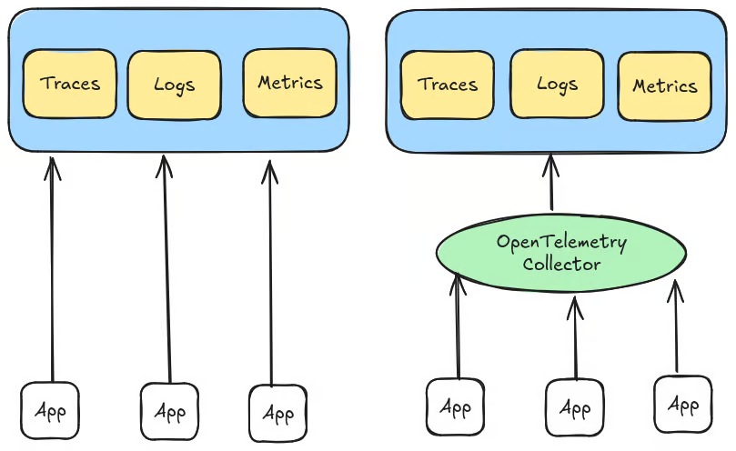

이번에 MSA 팀프로젝트를 진행하면서 API Gateway, 회원/인증, 모니터링 구축 파트를 맡게 되었다. 이 포스트는 모니터링을 구축하면서 했던 고민들을 작성해보고자 한다.

## 1. Observability 스택 구성 고민
> 💡 Observability란 애플리케이션이 "무슨 일이 일어나고 있는 지" 파악할 수 있는 정도를 의미한다. 
> 크게 '로그, 트레이스, 메트릭'의 3가지 요소로 나타낸다.

### 1-1. ELK vs Grafana + Loki
로그를 수집 및 시각화하기 위해 ELK와 Grafana + Loki 둘 중에 고민했었다.
결론은 Grafana + Loki를 선택했는데, 이유는 아래와 같다.
- 개발 시간과 예산, 복잡도를 고려했을 때 Loki가 적합(ELK 설정, 운영의 복잡성 & 높은 비용)
- 구글링을 통해 빅테크 기업도 ELK에서 Grafana + Loki로 변경하는 사례를 찾아볼 수 있었음

### 1-2 Zipkin vs Tempo
처음에는 Zipkin을 고려했었다. Spring boot + micrometer + Zipkin이 대중적이기 때문이었다.

Zipkin은 brave 기반이기 때문에, `micrometer-tracing-brave` 라이브러리를 추가해야했는데, 찾아보니 `micrometer-tracing-otlp`라는 라이브러리도 존재했고, 둘의 차이를 비교하고자 했다.

`otlp`가 OpenTelemetry라는 것을 알게되었고, 최근에 떠오르는 프레임워크이자, 표준화됨을 확인할 수 있었다.

> 💡 OpenTelemetry가 무엇인가?
> OpenTelemetry를 한 줄로 정의하자면, 분산 시스템에서 로그, 트레이스, 메트릭을 수집하고 내보내기 위한 표준화된 > SDK + Collector를 제공하는 오픈소스 프로젝트이다.



결론은 brave 대신 OpenTelemetry를 선택했고, 이유는 다음과 같다.
- OpenTelemetry가 CNCF에서 표준으로 자리 잡음
- 많은 관측 도구(Tempo, Loki, Prometheus 등)들이 OpenTelemetry Protocol(OTLP)을 따르는 추세이고, otlp를 지원하도록 지속적으로 개발되어 가고 있음
- OpenTelemetry 기반으로 진행하면 관측 도구 변경이 보다 자유로움(벤더에 종속적이지 않음)
- 표준화된 기술 스택을 좆고 싶은 마음도 존재

OpenTelemetry를 선택하게 되면서 대중적인 micrometer-brave + Zipkin을 고수할 필요가 없어졌고, 다른 분산 추적 도구를 고려하게 되었다. 그것이 Tempo였는데, 로그 수집 도구로 Loki를 선택하게 되면서 Grafana UI로 시각화를 하게 되었는데, Tempo를 선택하게 되면 로그, 트레이스를 한 눈에 볼 수 있다는 장점이 생겼다.

또한 Grafana 생태계가 `otlp`를 지원하려고 많은 노력을 하고 있었다.

### 1-3 메트릭 수집은 Prometheus
Prometheus를 적용하기에는 큰 고민이 없었다. Grafana에서 로그, 트레이스와 같이 한 눈에 볼 수도 있기도 해서 쉽게 선택하였다.

## 2. OpenTelemetry 적용 과정
지금부터는 OpenTelemetry를 적용하면서 어떤 고민들을 했는 지 작성해보고자 한다.

### 2-1. 수집 방법
찾아본 결과, OpenTelemetry를 통해 관측 데이터를 수집하는 방법은 총 3가지가 있었다.
그 중 2가지 방법은 OpenTelemetry에서 직접 제공하는 방법이고, 나머지 하나는 micrometer를 사용하는 방법이다.
- OpenTelemetry의 Java Agent
- OpenTelemetry의 Spring Boot Starter
- micrometer-tracing-bridge-otel

이 중에 마지막 방법인 `micrometer-tracing-bridge-otel` 방법을 채택하였고, 이유는 아래와 같다.
- Spring Boot 3.x 부터는 micrometer를 디폴트로 사용하고 있다는 점(Spring과 micrometer는 서로 잘 통합되어 있다.)
- OpenTelemetry에서 지원하는 것들을 사용하기에는 다양한 언어를 지원하는 상황에서 Java와 Spring를 위한 개발이 Spring + micrometer보다 원활하게 이루어질까하는 생각이 듦
- Java Agent 같은 경우 Spring native image를 사용하게 되면 반영이 되질 않음.
- OpenTelemetry Spring Boot Starter 또한 Java Agent의 대체제로 사용하라는 느낌으로 보여짐

이제 이렇게 수집한 데이터를 OpenTelemetry Collector에게 export 해주면된다.
우리 애플리케이션에서 데이터를 Collector에게 export 해주기 위해서는 application.yml에 collector의 앤드포인트를 설정해주어야한다.
참고 래퍼런스는 아래와 같다.

- 로깅
    - [Otel 로그 앤드포인트 설정](https://docs.spring.io/spring-boot/reference/actuator/loggers.html)
    - [logback 이벤트를 otel log SDK로 전송하기 위한 appender 적용](https://github.com/open-telemetry/opentelemetry-java-instrumentation/tree/main/instrumentation/logback/logback-appender-1.0/library)
    - [Otel-Collector 설정: Loki에 로그 수집](https://grafana.com/docs/loki/latest/send-data/otel/)
- 트레이싱
    - [Tracing: OTLP 디펜던시 추가](https://docs.spring.io/spring-boot/reference/actuator/tracing.html)
- 메트릭
    - [매트릭 데이터를 Collector로 export 하기 위한 설정](https://docs.spring.io/spring-boot/reference/actuator/metrics.html#actuator.metrics.export.otlp)
    - [(참고) 프로메테우스 pull 방식 사용 시 추가 설정](https://prometheus.io/docs/guides/opentelemetry/)
    - [프로메테우스 push 방식 사용 시 메트릭 순서 보장을 위한 설정](https://github.com/prometheus/prometheus/blob/main/documentation/examples/prometheus-otlp.yml)
    - [프로메테우스 push/pull 방식에 대한 설명](https://grafana.com/blog/2023/07/20/a-practical-guide-to-data-collection-with-opentelemetry-and-prometheus/#6-use-prometheus-remote-write-exporter)

### 2-2 OpenTelemetry Collector 설정
otel collector에서 Tempo, Loki, Prometheus로 데이터를 각각 보내주기 위해서는 아래와 같은 설정을 해주어야했다.
```yml
# Collector 설정

# Receiver
receivers:
  otlp:
    protocols:
      http:
        endpoint: "0.0.0.0:4318" # App과 Collector간의 HTTP 통신 포트

# Processor
processors:
  batch:

# Exporters
exporters:
  # traces
  otlp/tempo:
    endpoint: tempo:4317 # 트레이스 데이터를 Tempo로 내보내겠다.
    tls:
      insecure: true
  # logs
  otlphttp/logs:
    endpoint: "http://loki:3100/otlp" # 로그 데이터를 Loki로 내보내겠다.
    tls:
      insecure: true
  # metrics
  prometheusremotewrite: # 스크래핑 방식이 아닌 push 방식을 사용할 것이다.
    endpoint: "http://prometheus:9090/api/v1/write" # 메트릭 데이터를 Prometheus로 내보내겠다.
    tls:
      insecure: true

# 파이프라인 구성
service:
  pipelines:
    traces:
      receivers: [otlp]
      processors: [batch]
      exporters: [otlp/tempo]
    logs:
      receivers: [otlp]
      processors: [batch]
      exporters: [otlphttp/logs]
    metrics/prod:
      receivers: [otlp]
      processors: [batch]
      exporters: [prometheusremotewrite]
```

### 2-3 프로메테우스의 pull/push 방식
프로메테우스에 메트릭을 수집하는 방법은 두가지로 나뉘었다. 프로메테우스가 우리 애플리케이션에서 직접 스크래핑해가는 `pull` 방식과, Otel-Collector에서 프로메테우스로 데이터를 보내는 `push` 방식이다.

두 가지 방법 중에 `push` 방식을 선택했는데 프로메테우스 래퍼런스를 참고한 결과 `pull` 방식은 OTLP receiver가 여러 인스턴스일 때, 메트릭의 방대한 양에 의한 스파이크가 존재할 수 있다는 단점이 존재하기 때문이었다.

해당 래퍼런스에서도 이를 방지하기 위해 `push` 방식을 지원하고 사용하라고 얘기하는 듯 보였다.

반면에 `push` 방식은 메트릭의 순서를 보장하지 못한다는 단점이 존재했다. 하지만 이 부분은 OOO(out-of-order ingestion) 설정을 통해 해결할 수 있다고 공식 문서에 적혀있어서 큰 문제는 없다.