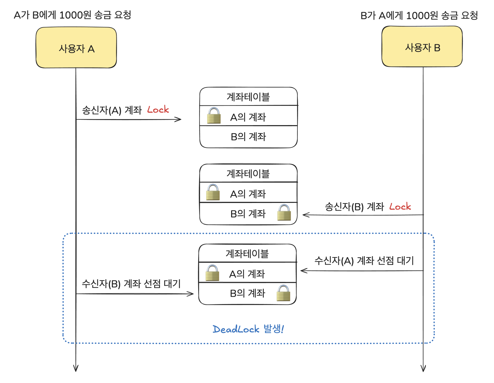

## 미니페이 프로젝트에서의 동시성 트러블 슈팅
미니페이 프로젝트는 카카오 페이의 미니으로, 토이 프로젝트입니다. 간단하게 아래와 같은 기능들이 있으나, 이번 글은 `송금 API에서의 동시성 이슈`에 대해 발표하고자 합니다.
- 계좌 충전
- 송금
- 정산

이번 발표에서 다룰 도메인은 `회원`, `몌인 계좌` 입니다.
`메인 계좌` 테이블은 `회원`과 1:1로 연관관계를 맺고 있고, 멤버 필드로 잔액(`balance`)을 갖고 있습니다.

따라서, `송금 API`는 송신자와 수신자, 그리고 보낼 금액이 요청으로 들어왔을 때 계좌의 잔액을 업데이트해주는 것으로 진행이 됩니다.

이미 동시성 이슈가 발생할 수 있음을 짐작했기에, 락을 사용하고자 했습니다. 락은 비관락, 낙관락, 분산락의 선택지가 있었지만, Redis의 분산락은 추후에 고려하는 방식으로 진행했고, 계좌 잔액의 경우 빈번하게 업데이트가 발생할 수 있는 컬럼이라고 생각하여 DB락 중 '비관락(쓰기락)'으로 해결하고자 했습니다.

따라서 `계좌 엔티티`를 Select 해오는 JPQL을 아래와 같이 작성해주었습니다.
```java
@Lock(PESSIMISTIC_WRITE)
@Query("SELECT c FROM CheckingAccount c WHERE c.owner.id = :owner_id")
Optional<CheckingAccount> findByOwnerIdForUpdate(@Param("owner_id") Long ownerId);
```

이제 비관락을 적용했으니, 테스트 코드를 작성해서 의도한 대로 동작하는 지 확인하고자 했습니다.

아래에서 `송금 동시성 테스트`를 작성한 예제를 볼텐데, 테스트에 대한 간단한 설명은 아래와 같습니다.
- 내가 친구에게 2만원 송금 100번 요청
- 친구가 나에게 2만원 송금 100번 요청
- 계좌 잔액 검증


테스트 코드를 보겠습니다.
```java
  @Test
  @DisplayName("송금 동시성 테스트")
  void charge_remit_concurrent_deadlock() throws InterruptedException {
    // given
    Member me = saveAndGetMember(ME);
    Member friend = saveAndGetMember(FRIEND);

    // 내가 친구에게 송금 request
    CheckingAccountRemitRequest myRemitRequest = new CheckingAccountRemitRequest(
        me.getId(), friend.getId(), 20_000L);

    // 친구가 나에게 송금
    CheckingAccountRemitRequest friendRemitRequest = new CheckingAccountRemitRequest(
        friend.getId(), me.getId(), 20_000L);

    int nThreads = 30;
    int repeat = 100;
    ExecutorService executorService = Executors.newFixedThreadPool(nThreads);
    CountDownLatch countDownLatch = new CountDownLatch(repeat * 2);

    // when
    for (int i = 0; i < repeat; i++) {
      executorService.execute(() -> {
        checkingAccountService.remit(myRemitRequest); // 나 -> 친구 송금
        countDownLatch.countDown();
      });

      executorService.execute(() -> {
        checkingAccountService.remit(friendRemitRequest); // 친구 -> 나 송금
        countDownLatch.countDown();
      });
    }

    countDownLatch.await();
    executorService.shutdown();

    assertThat(myCheckingAccount.getBalance()).isEqualTo(기대 금액);
    assertThat(friendCheckingAccount.getAmount()).isEqualTo(기대 금액);
  }
```

테스트의 결과는 `데드락 발생` 이였습니다. 이유는 송금 로직에서 살펴보겠습니다.

아래는 당시의 `송금 서비스` 코드입니다.

```java
public RemitResponse remit(CheckingAccountRemitRequest request) {
    Long senderId = request.getSenderId();
    Long receiverId = request.getReceiverId();
    long amount = request.getAmount();

    // 송신자, 수신자 계좌 Select 시 'DB락(비관락)'
    CheckingAccount senderAccount = getCheckingAccountForUpdate(senderId);
    CheckingAccount receiverAccount = getCheckingAccountForUpdate(receiverId);

    if (senderAccount.getBalance() < amount) {
      autoCharge(senderAccount, senderAccount.getBalance(), amount, senderId);
    }

    senderAccount.withdraw(amount);
    receiverAccount.deposit(amount);

    return RemitResponse.of(senderAccount);
  }
```

데드락이 발생한 이유를 그림으로 보겠습니다.

송금을 수행하는 코드에서는 하나의 트랜잭션에서 `2개의 락`을 필요로 합니다. 이는 각각 `송/수신자의 계좌 락`입니다.

두 요청을 간단히 표현하자면, `A와 B가 서로가 서로에게 송금`해주는 로직입니다.
다시 한번 송금 코드를 보면,
```java
// 송신자 계좌 select
CheckingAccount senderAccount = getCheckingAccountForUpdate(senderId);

// 수신자 계좌 select
CheckingAccount receiverAccount = getCheckingAccountForUpdate(receiverId);
```

두 트랜잭션이 서로의 송/수신자가 뒤바뀐 요청이기 때문에 각 요청의 `송신자 계좌 락`을 하게 되면 `A와 B 계좌`를 서로가 하나씩 점유하게 됩니다.

따라서 두 트랜잭션이 `수신자 계좌 락`을 얻지 못하고 데드락이 발생하게 됩니다.

이는 자원(락)의 선점 순서를 정렬해주는 것으로 해결하였습니다.

아래는 수정된 코드입니다.

```java
public RemitResponse remit(CheckingAccountRemitRequest request) {
    Long senderId = request.getSenderId();
    Long receiverId = request.getReceiverId();
    long amount = request.getAmount();

    CheckingAccount senderAccount;
    CheckingAccount receiverAccount;

    // 회원의 id로 락 선점 순서 정렬(회원 id가 작은 계좌부터 선점할 수 있도록 진행)
    if (senderId < receiverId) {
      senderAccount = getCheckingAccountForUpdate(senderId);
      receiverAccount = getCheckingAccountForUpdate(receiverId);
    } else {
      receiverAccount = getCheckingAccountForUpdate(receiverId);
      senderAccount = getCheckingAccountForUpdate(senderId);
    }

    if (senderAccount.getBalance() < amount) {
      autoCharge(senderAccount, senderAccount.getBalance(), amount, senderId);
    }

    senderAccount.withdraw(amount);
    receiverAccount.deposit(amount);

    return RemitResponse.of(senderAccount);
  }
```

다시 테스트를 실행하면, 의도한 대로 동작함을 확인할 수 있었습니다.
> 해결할 수 있는 문제인지는 모르겠지만, 데드락 해결 후의 코드에서 `if/else` 내부에서 락의 선점 순서를 정렬한 것이 코드가 그리 이뻐보이진 않다는게 아쉬웠습니다..