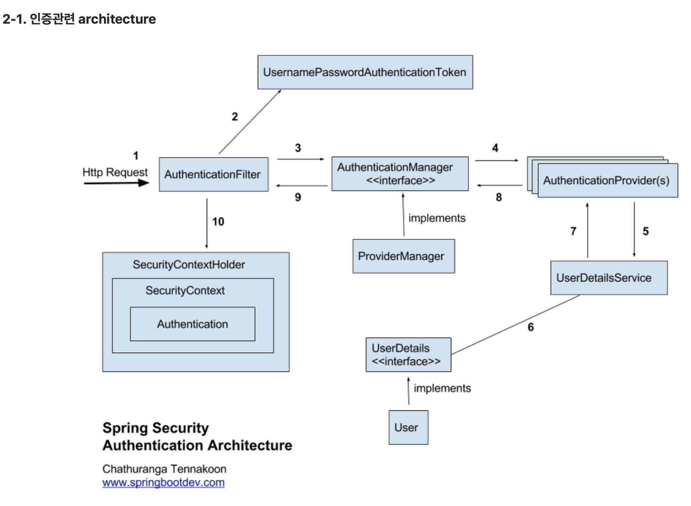

## Spring Security를 활용하여 소셜 로그인 직접 구현하기
이번 발표에서는 스프링에서 제공하는 `oauth2-client` 라이브러리를 사용하지 않고, 소셜 로그인을 구현했던 경험을 발표하고자 합니다.

### OAuth2란?
OAuth의 사전적 의미는 인터넷 사용자들이 비밀번호를 제공하지 않고 다른 웹 사이트 상의 자신들의 정보에 대해 웹 사이트나 애플리케이션의 접근 권한을 부여할 수 있는 공통적인 수단으로서 사용되는 접근 위임을 위한 개방형 표준이라고 합니다.

쉽게 말하면, 애플리케이션을 이용할 때 사용자가 해당 애플리케이션에 ID, PW등의 정보를 제공하지 않고, 신뢰할 수 있는 외부 에플리케이션(Naver, Google, Kakao, Facebook 등)의 Open API에 ID, PW를 입력하여 해당 어플리케이션이 인증 과정을 처리해주는 방식입니다.

### OAuth2 프로토콜의 Grant Type
OAuth2의 Grant Type은 클라이언트가 어떤 방식으로 리소스 소유자(사용자)의 권한을 위임받아 액세스 토큰을 발급받는지를 정의하는 방식입니다.
> 클라이언트란 소셜로그인을 구현할 우리의 서버라고 생각하면 되고, 리소스 소유자(사용자)는 소셜로그인을 할 회원입니다.

OAuth2의 Grant Type으로는 아래와 같은 방식들이 있습니다.
- Authorization Code
- PKCE
- Client Credentials
- Device Code
- Refresh Token

이 중에서 제가 사용했던 방법은 `Authorization Code` 방식이었는데, 이유는 가장 많이 사용되고 보안이 높다라는 장점 때문입니다.

### Authorization Code Grant의 흐름
`Authorization Code` 방식의 흐름에서 우리가 응답 받아야할 데이터는 아래와 같습니다.
- Authorization Code
- Access Token
- 사용자 정보(User Info)

`Authorization Code`는 사용자가 '카카오 로그인' 버튼을 눌렀을 때, 카카오에 ID/PW를 입력하게 되면, 로그인 성공 시 응답으로 받아오게 되는 데이터입니다.

이 코드로 백엔드 서버(소셜로그인을 제공할 애플리케이션)에서 카카오로 액세스 토큰을 요청할 수 있게됩니다.

마지막으로 발급 받은 액세스 토큰으로는 사용자 정보를 요청하고 받아올 수 있습니다.

### spring-security-oauth2-client 라이브러리
`spring-security-oauth2-client`는 OAuth2 로그인 기능을 쉽게 구현할 수 있도록 도와주는 라이브러리입니다.

간단한 설정만 추가해주면, 사용자가 소셜 로그인 버튼(예로 카카오 or 구글)을 클릭 시, `Authorization code`부터 사용자 정보까지 쉽게 조회해줍니다.(내부적으로 `RestTemplate`를 활용하여 외부 API 호출을 함.)

따라서, 소셜 로그인을 구현하고자 하면 `spring-security-oauth2-client`를 활용 시, 쉽고 확장성 있게 구현할 수 있습니다.

### 저는 왜 라이브러리를 사용하지 못했는가?
`oauth2-client` 라이브러리를 사용하면 소셜로그인을 쉽고 확장성 있게 구현할 수 있는데, 왜 사용하지 못했냐면, 위에서 설명했다시피, 라이브러리를 활용하면 `Authorization Code`를 받아오는 것부터 사용자 정보까지 백엔드에서 모두 이루어지게 됩니다.
> 보안적으로도 백엔드에서 모두 이루어지는 것을 권장한다고 합니다.

하지만, 당시 프론트앤드 분들께서 포트폴리오로써 `Authorization Code`는 프론트에서 발급 받아오고 싶어하셨습니다.
따라서, 백엔드에서는 프론트에서 넘겨준 `Authorization Code`를 활용하여 액세스 토큰을 발급 받아오는 과정부터 진행해야했기 때문에 라이브러리 대신 직접 구현하는 방식으로 진행했습니다.

### 트러블 슈팅
사실 외부 API만 호출하면 되는 것이기 때문에 구현 자체는 어렵지 않았습니다. 프론트앤드에서 현재 어떤 소셜 로그인을 진행할 것인지와 발급 받아온 `Authorization Code`를 요청으로 넘겨주면 그에 맞게 구현해내기만하면 됐습니다.

그래서 이를 `Controller`에 앤드포인트를 작성했고, `Service`에서 `FeignClient`를 활용하여 외부 API를 호출했습니다.
> 여기서 외부 API란 Authorization Code로 액세스 토큰을 발급받아오고, 액세스 토큰으로 사용자 정보를 조회해오느 2가지 과정을 뜻합니다.

그리고, 사용자가 로그인에 성공했기 때문에, JWT 토큰을 발급해주었습니다.

하지만, 여기서 문제가 발생했습니다. 원인은 이미 Spring Security를 활용하여 일반 로그인을 제공하고 있으며, 로그인 성공 시 JWT 발급 또한 Spring Security의 `LoginSuccessHandler`에 작성되어 있었습니다.

무엇이 문제냐면, 일반 로그인은 스프링 시큐리티 필터내에서 처리되지만, 소셜 로그인은 서블릿에서 처리가 되고 있다는 점과, 로그인 성공 시 후처리(JWT 발급 등) 로직이 두 위치에서 존재하게 된다는 점이었습니다.

따라서 소셜 로그인 또한 Spring Security 필터 체인 내부에서 구현하는 것이 맞다고 판단했고, 이를 구현하기 위해 시큐리티의 인증 플로우를 파악하고자 했습니다.

### Spring Security의 인증 흐름

제가 이해한 바로 중요한 클래스(혹은 인터페이스)만 간단하게 설명해보자면,
- AuthenticationManager: 인증 총 책임자
- AuthenticationProvider: 실질적인 인증 담당(일반로그인으로 예시를 들면, username과 password 검증)
- AuthenticationToken: 인증 서류(동사무소에서 접수 전 작성하는 서류라고 생각하면 될 듯 합니다.)
  - 일반 로그인으로 예를 들면, 일반 로그인을 하기 위한 목적의 서류입니다.(ID/PW를 적는 칸이 존재)
  - ID/PW를 적어서 동사무소 직원에게 건내줌(인증되지 않은 서류를 AuthenticationManager에게 건내줌)

이어서 설명하자면, AuthenticationManager는 해당 서류를 AuthenticationProvider에게 위임하고, Provider는 실질적인 인증(검증)을 수행하게 됩니다.

인증이 완료되면 위에 인증되지 않은 서류(AuthenticationToken)는 '인증된 서류'로 재탄생되고, 시큐리티 생태계 내부에서는 `Authentication` 객체로써 `SecurityContext`에 들어가서 사용자가 인증되었음을 입증하는 역할을 하게됩니다.

### 그래서 무얼 커스텀해서 직접 구현할 수 있는가?
직접 커스텀해야할 클래스는 많지 않습니다. 
- 소셜 로그인 요청을 받을 필터 클래스
- 소셜 로그인을 직접 담당할 `AuthenticationProvider`
- 소셜 로그인 전용 서류 `AuthenticationToken`

위와 같은 클래스들을 커스텀했고, `Provider` 내부에서는 실질적으로 `FeignClient` 등의 외부 API 호출 도구를 활용하여 액세스 토큰과 사용자 정보를 조회해오게 됩니다.
> 이미 가입된 사용자를 검증하고, DB에 저장하는 로직도 포함됩니다.

### 추가 내용
사실 소셜 로그인은 카카오, 네이버, 구글, 페이스북 등 여러 개가 존재할 수 있어서 언제든 추가될 수 있습니다.
따라서 내부적으로 외부 API를 호출할 때, 각 리소스 서버 별로 분기처리를 해줘야하는 상황이 발생합니다.
이는 `전략 패턴`을 사용해서 확장성 있게 구현해냈습니다.

