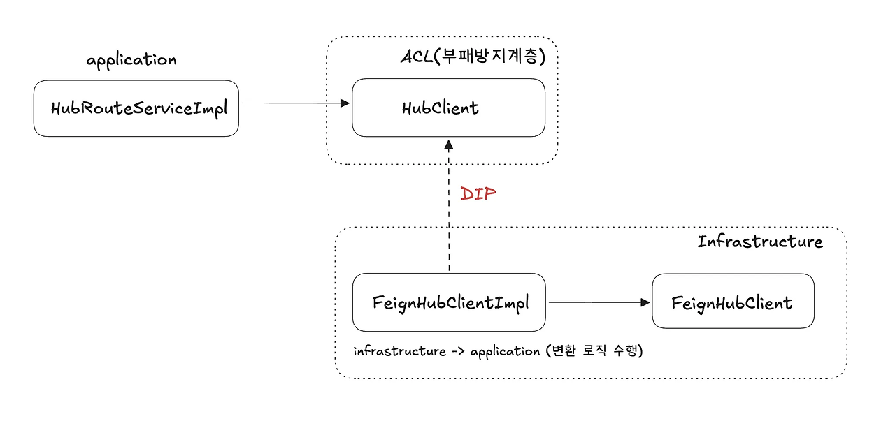
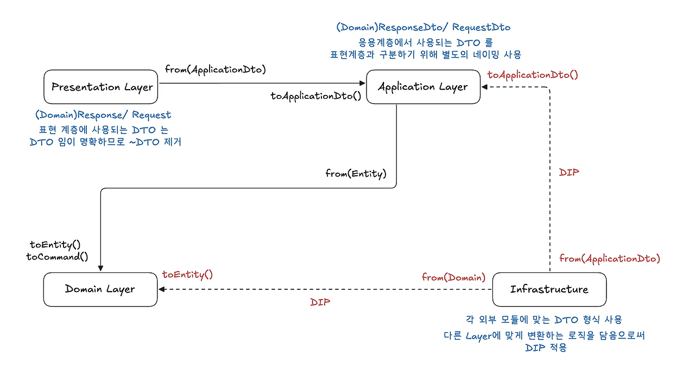

# DDD 4계층 구조와 역방향 의존성

---

## 계층 구조란
관심사 분리를 위한 아키텍처 구조로 각 계층이 자기 역할만 수행하고, 상위 계층만 참조하는 것이다.


## DDD란
Domain-Driven Design (Domain-Driven Design)은 소프트웨어 개발 방법론 중 하나로, 복잡한 도메인을 이해하고 효과적으로 모델링하기 위해 사용되는 개발 철학과 방법이다. 도메인 주도 설계라고도 부르는데, 도메인에 집중하며 도메인의 복잡성을 최소화하기 위해 소프트웨어를 설계하고 개발한다.


위에서 말하는 도메인 모델이란 도메인의 핵심 개념과 규칙을 객체로 표현한 것을 말한다. 도메인 자체를 표현하는 개념적인 모델을 의미하지만, 도메인 계층을 구현할 때 사용하는 객체 모델을 언급할 때에도 '도메인 모델'이란 용어를 사용한다. 비즈니스 로직을 담고 있으며, 도메인 전문가들과의 협력을 통해 구축된다.


DDD는 개발 생산성과 유지보수에 관련이 높다. 모두 비용에 관련된 부분이기 때문에 클린 아키텍처의 관점에서 소프트 웨어 개발 방법론의 일부인 것이다.

뚜렷한 정답이 있기 보단 최적화된 방향성을 제시한다.


이제 3계층 구조와 4 계층 구조와의 차이와 구조를 분리하고 역방향 의존성까지 제거하면 어떤 이점이 있는지 확인해 보자.

일반적으로 디렉터리나 클래스 구성에서 구조는 위 계층 구조를 가지게 된다.

3계층 구조와 4 계층 구조를 가지게 되는데 3 계층 구조부터 확인해 보자.

---

### 3 계층 구조

presentation 계층, application 계층, domain 계층으로 나누어 가지게 된다.

3계층 구조에서 이 3 계층을 간략히 설명하면 presentation은 controller를 가지는 요청을 받고 응답을 반환해 주는 계층, application 계층은 서비스로 비즈니스 로직을 갖는 계층, domain 계층은 핵심 비즈니스를 가지는 계층이다. 핵심 비즈니스를 가질 때 도메인에 관련된 정책이나 모델, 규칙을 정하게 된다. 이렇게 3가지 계층을 가지는데 보통 mvc를 통한 controller, service, repository 디렉터리를 계층으로 나누어 설계하는 것이 일반적이다.
````
project-root/
├── src/
│   ├── main/
│   │   ├── java/com/example/
│   │   │   ├── controller/
│   │   │   ├── service/
│   │   │   ├── repository/
│   ├── resources/
````
### 4 계층 구조
presentation 계층, application 계층, domain 계층에서 infrastructure 계층이 추가된 구조이다.

domain 까지는 위 3 계층과 같은 의미를 가진 계층이고 추가된 infrastructure는 외부 서비스와 통신하는 계층이다. DB, 메시징 시스템 등 외부 인프라와 연결되어야 하는 계층을 분리한 구조이다.
````
project-root/
├── src/
│   ├── main/
│   │   ├── java/com/example/
│   │   │   ├── presentation/
│   │   │   ├── application/
│   │   │   ├── domain/
│   │   │   ├── infrastructure/
│   ├── resources/
````

이렇게 계층만 하나 늘어난 게 좋지 않다고 생각할 수 있는데 구조를 나눔으로 각 계층의 의미와 역할을 부여하고 단일 책임을 갖게 하는 것이 목표이다. 각 계층에 대한 역할이 분명하니 다른 계층에 대한 오염을 최대한 줄인다면 독립적으로 각 계층에 의미에 맞는 역할을 할 수 있게 된다.


3 계층과 4 계층 구조의 차이를 한눈에 알아보자.

| 항목             | 3계층 구조                        | 4계층 구조                            |
|------------------|-----------------------------------|----------------------------------------|
| 서비스 계층 역할 | 유스케이스 + 도메인 처리          | 유스케이스만                          |
| 도메인 모델 위치 | 서비스 내 포함                    | 명확히 분리된 계층                    |
| 인프라 계층      | 보통은 리포지토리 구현 수준       | 더 다양한 외부 연동 담당             |
| 장점             | 단순, 구현 빠름                   | 관심사 분리, 테스트 용이              |
| 사용 예          | 소규모, CRUD 중심                 | 도메인 복잡한 대규모 시스템          |


각 구조와 차이를 확인하게 되었을 때 처음에 와닿지 않았고 3 계층만 사용 했을때 빠른 개발은 가능 했다. 하지만 유지보수와 OOP 관점에서 구조가 난잡했기에 코드 변경이나 추가가 굉장히 어려워졌다. 3계층 구조 당시 한 부분을 수정하거나 추가한다면 모든 계층에 작업을 해야 하는 일이 발생했다. 이를 4 계층으로 변경하고 각 계층의 의미를 명확히 하고 의존성을 분리하니 수정점은 줄어들고 가독성도 향상되게 되었다. DDD를 적용해 4 계층을 구성한 최종적 이점에 대해서는 마지막에 의존성 역행을 제거한 부분 뒤에 기술하도록 하겠다.

---

## 역방향 의존성 제거
MSA 프로젝트 진행 중 각 서비스가 독립적으로 운영되어야 한다. 이런 관점에서 하나의 서비스 내부에서도 각 계층은 독립적으로 나뉘어도 문제가 없게끔 구성해야 한다. 이 말은 하나의 서비스 구조에서 각 계층이 모듈로써 나누어져도 각 계층을 정상적으로 동작할 수 있게 하는 것이라는 말이 된다. 서비스 내부에서 독립성에서 더 나아가 전체 시스템에서 각 서비스의 독립성까지 갖추는 게 DDD 기반 아키텍처가 된다.


내부적인 계층 간에 presentation -> application -> domain -> infrastructure의 방향으로 흐르게 됨

역행해서 다음 계층의 의존성을 가지면 안 되고 도메인은 순수히 다른 계층 및 특정 프레임 워크나 라이브러리에 종속되어선 안 되며 이는 각 계층이 독립적으로 동작해 결합을 낮추고 응집을 높여 유지보수를 용이하게 하며, 변경에 대한 유연성을 가지게 되는 것

프로젝트에서 의존성 역행을 방지하기 위해 적용한 게 ACL과 DIP를 적용한 인터페이스 생성


ACL(부패 방지 계층)



DIP(의존 역전 원칙)


DIP의 개념을 활용해 Infrastructure에서 application으로 역행하는 의존을 방지

Presentation, Application, Infrastructure 각 계층의 소통은 DTO와 내부 to, from을 사용해 변환으로 모든 계층에서의 역행을 방지

DSM(Dependency Management System)을 사용해 순환 참조나 불필요한 의존성 존재 확인 가능하다.


DDD와 4 계층 구조를 가짐으로 각 계층이 독립적으로 동작하며 결합도를 낮추고, 응집도를 높여 유지보수를 용이하게 하며, 각 계층이 다른 계층에 대해 의존성이 역행하지 않기 때문에 변경점은 단일 변경점이 되어 변경에 유연하게 대응하게 된다. 이로써 단위 테스트를 진행하게 될 때도 다른 계층에 대한 의존이 적기 때문에 쉬운 테스트 코드의 작성이 가능하다.

또한 객체지향 원칙인 SOLID에 대해서도 지키게 된다.

---

### 위 구조를 통해 각 원칙들로 지킬 수 있는 부분
SRP - 단일 책임 원칙 - 계층적으로나 구조적으로나 각 계층과 객체는 하나의 역할과 책임을 갖게 한다.

OCP - 개방 폐쇄 원칙 - 구조적으로 각 계층에 대한 역할에 따라 확장은 가능하고 수정에 대해서 수정하지 않아도 되거나 수정점이 하나가 된다.

LSP - 리스코프 치환 원칙 - 부패 방지 계층을 적용함으로 상위 타입을 통해 하위 타입을 대체할 수 있고 상위 타입은 자신의 역할에 맞는 계층에 존재하게 된다.

ISP - 인터페이스 분리 원칙 - infrastructure 내부에서 QueryDsl에 대한 부분이나 jpaRepository의 기능을 인터페이스로 분리하고 부패 방지 계층에서도 각 해당하는 client의 추가를 인터페이스를 분리해 구현할 수 있는 점에서 각 인터페이스가 자신의 역할에 맞게 분리될 수 있다.

DIP - 의존 역전 원칙 - 하위에 의존하지 않고 상위 인터페이스에 의존하는 것으로 ACL을 통해 구현하게 되었고 코드 레벨이 아닌 계층적 구조의 분리로 각 계층에 대해 반대로 역행하지 않게끔 상위 인터페이스만을 의존해 독립적인 구조를 구성할 수 있게 된다.