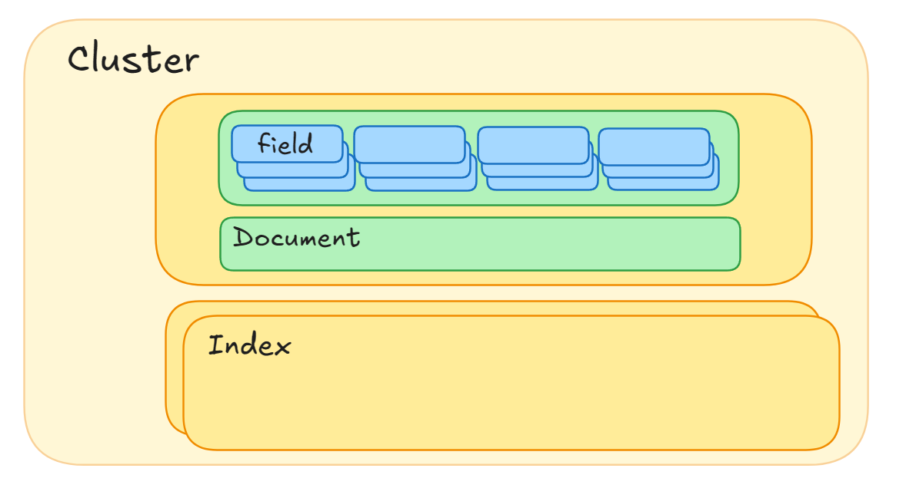
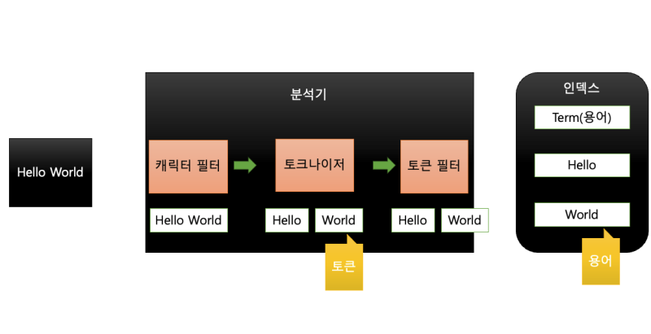
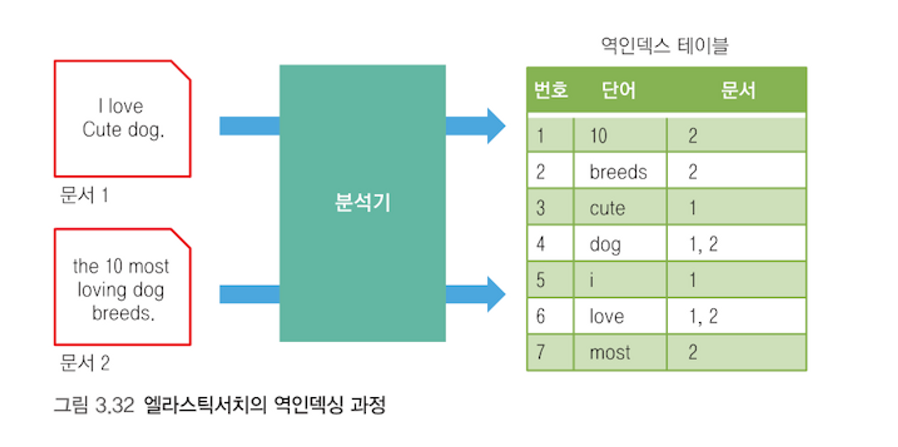

# elastic search 기초

### 데이터 구조

- 클러스터: 하나의 프로젝트에 하나의 클러스터를 생성해 사용
- 인덱스: 도큐먼트를 저장하는 논리적 구분자
- 도큐먼트: 실제 데이터를 저장하는 단위, JSON 형태, 복수의 필드를 갖는다.

#### MySQL과 비교

MySQL | 엘라스틱서치
-- | --
테이블| 인덱스
레코드 | 도큐먼트
컬럼 | 필드
스키마 | 매핑

#### 매핑 mapping
엘라스틱서치 매핑으로 인덱스 스키마와 필드들의 데이터 타입을 지정할 수 있다.

#### 타입 type
엘라스틱 7.x 이전 버전에 존재했던 데이터 구조이나, 현재는 더 이상 사용하지 않는다. 이전에 인덱스(테이블)처럼 동작했다.
- 하나의 인덱스 내부에서 여러 타입을 지정할 수 있었다.
- 즉, 인덱스 내부에 타입에 따라 각각 다른 스키마의 도큐먼트들을 저장할 수 있었다.

### 도큐먼트
- 데이터가 저장되는 기본 단위로 JSON 형태이며 하나의 도큐먼트는 여러 필드와 값을 갖는다.
- 도큐먼트는 반드시 하나의 인덱스에 포함돼야 한다.

### 인덱스
- 인덱스는 영어 소문자를 비롯해 일부 문자를 제외한 특수문자를 사용할 수 있으며 255 바이트를 넘을 수 없다.

#### 스키마에 따른 그룹핑
- 일반적으로 스키마에 따라 인덱스를 구분한다.

#### 관리 목적의 그룹핑
- 인덱스가 너무 커지면 성능이 나빠지는 문제가 있으므로, 엘라스틱서치를 운용할 때 인덱스 용량 제한을 둔다.
  - 기본적으로 특정 도큐먼트 개수에 도달하거나 용량을 넘어서면 인덱스를 분리한다.
  - 일/주/월/년 단위 같은 날짜/시간 단위로 인덱스를 분리할 수 있다.
- 효율적으로 대량의 데이터를 관리하기 위해 그룹핑을 수행한다.

## es 기본 API
### 인덱스 생성/확인/삭제
```
PUT index1
GET index1
DELETE index1
```
- 인덱스를 삭제하면, (당연히) 내부 도큐먼트들도 모두 삭제된다. 주의 필요!

### 도큐먼트 생성
#### 인덱싱 indexing
- 도큐먼트는 반드시 하나의 인덱스에 포함되어야 하며, 이러한 작업을 인덱싱이라고 한다.

```
PUT hidle/_doc/1
{
  "name": "han",
  "age": 20,
  "region": "충청도",
  "gender": "male"
}

GET hidle
```
- 기존에 존재하지 않는 인덱스라면, 도큐먼트와 함께 생성한다.
- 타입을 따로 지정하지 않아도 도큐먼트의 필드와 값을 보고 자동으로 매핑을 지정한다. 이런 기능을 **다이내믹 매핑**이라고 한다.

```
PUT hidle/_doc/2
{
  "name": "kang",
  "region": "경상도"
}

PUT hidle/_doc/3
{
  "name": "park",
  "age": "20",
  "gender": "female"
}
```

- 인덱스 조회 결과
```json
{
  "hidle": {
    "aliases": {},
    "mappings": {
      "properties": {
        "age": {
          "type": "text",
          "fields": {
            "keyword": {
              "type": "keyword",
              "ignore_above": 256
            }
          }
        },
        "city": {
          "type": "text",
          "fields": {
            "keyword": {
              "type": "keyword",
              "ignore_above": 256
            }
          }
        },
        "gender": {
          "type": "text",
          "fields": {
            "keyword": {
              "type": "keyword",
              "ignore_above": 256
            }
          }
        },
        "name": {
          "type": "text",
          "fields": {
            "keyword": {
              "type": "keyword",
              "ignore_above": 256
            }
          }
        },
        "region": {
          "type": "text",
          "fields": {
            "keyword": {
              "type": "keyword",
              "ignore_above": 256
            }
          }
        }
      }
    },
    "settings": {
      "index": {
        "routing": {
          "allocation": {
            "include": {
              "_tier_preference": "data_content"
            }
          }
        },
        "number_of_shards": "1",
        "provided_name": "hidle",
        "creation_date": "1749987416355",
        "number_of_replicas": "1",
        "uuid": "WH17k0DNQIKYOGcuRe-39w",
        "version": {
          "created": "8518000"
        }
      }
    }
  }
}
```
- 새로운 필드 데이터가 들어오면 자동으로 필드가 추가된다.
- 데이터 타입을 잘못 지정해도 엘라스틱서치가 스키마에 유연하게 대응하여 타입을 변환해 저장한다.

#### 대표적인 형변환 규칙
- 숫자 필드에 문자열이 입력되면 숫자로 변환을 시도한다.
- 정수 필드에 소수가 입력되면 소수점 아래 자리를 무시한다.

### 도큐먼트 읽기
크게 2가지 방법이 있다.
- 도큐먼트 아이디를 이용하여 조회하는 방법
  - 빅데이터 환경에서 도큐먼트 하나씩 조회하는 경우는 드물기에 잘 사용되지 않는다.
- 엘라스틱 서치가 제공하는 쿼리 DSL(Domain Specific Language)을 이용하여 검색

```
GET hidle/_doc/3

// 형변환 규칙과 관련 - 아래 응답을 보면 age에 "20"으로 값이 들어가 있다.
{
  "_index": "hidle",
  "_id": "3",
  "_version": 1,
  "_seq_no": 2,
  "_primary_term": 1,
  "found": true,
  "_source": {
    "name": "park",
    "age": "20",
    "gender": "female"
  }
}

// DSL 쿼리, 인덱스 내 모든 도큐먼트 조회
GET hidle/_search
```

### 도큐먼트 수정
- 생성과 동일한 API 활용
  -도큐먼트를 인덱싱하는 과정에서 같은 도큐먼트 아이디가 있으면 덮어쓰기로 처리한다.
  - API 응답 결과에 도큐먼트가 업데이트 되었다고 나온다.
```
PUT hidle/_doc/1
{
  "name": "choi",
  "age": 20,
  "region": "충청도"
}
```

- update API 이용
  - 특정 필드의 값만 업데이트 할 수 있다.
```
POST hidle/_update/1
{
  "doc": {
    "name": "choi"
  }
}
```

- 엘라스틱서치 도큐먼트 수정 작업은 비용이 많이 들어서 권장되지 않는다.
  - 개별 도큐먼트 수정이 많은 작업이라면 엘라스틱서치가 아닌 다른 DB를 이용하는 것이 좋다.

### 도큐먼트 삭제
```
DELETE hidle/_doc/2
```

- 도큐먼트 수정과 마찬가지로 개별 도큐먼트 삭제 또한 비용이 많이 들어가는 작업인 만큼 사용에 주의가 필요하다.

### 벌크 데이터 API
```
PUT /_bulk
{"index": {"_index": "hidle", "_id": "1"}}
{"name":"han", "gender":"male", "region":"충청도"}
{"create": {"_index": "hidle", "_id": "5"}}
{"name":"hwang", "gender":"female", "region":"경상도"}
{"create": {"_index": "hidle", "_id": "4"}}
{"name":"choi", "gender":"male", "region":"충청도"}
{"update": {"_index": "hidle", "_id": 4}}
{"doc":{"age": 20}}
{"delete": {"_index": "hidle", "_id": "5"}}
```

- 벌크로 한 번에 요청을 하는 것이 효율적이다.
  - API 콜 횟수를 줄여 성능을 높일 수 있다.
- bulk API 는 읽기는 지원하지 않고 생성/수정/삭제만 지원한다.
  - 삭제(delete)만 한 줄로 작성하고 나머지 작업들(index, create, update)은 두 줄로 작성한다.
- **NDJSON**(New-line Delimited JSON) 형태의 문법을 사용한다.
  - 각 줄 사이에 쉼표 등 별도의 구분자 없이 줄바꿈만 수행하며, 라인 사이의 공백을 허용하지 않는다.
- 벌크 데이터를 파일 형태로 만들어 적용하는 방법도 있다.
  - 현업에서 실용성 있게 활용 가능

## 매핑
- 스키마: 관계형 데이터베이스에서 테이블을 구성하는 구성요소 간의 논리적인 관계와 정의를 의미
- 엘라스틱서치에서 스키마 역할을 수행하는 것이 매핑이다.
  - JSON 형태의 데이터를 루씬이 이해할 수 있도록 바꿔주는 작업이다.
- 전문 검색과 대용량 데이터를 빠르게 실시간 검색할 수 있도록 돕는다.
- 엘라스틱 서치가 자동으로 처리하는 다이내믹 매핑과 직접 사용자가 설정하는 명시적 매핑 방식으로 구분할 수 있다.

### 다이내믹 매핑
- 엘라스틱서치는 유연한 활용을 위해 인덱스 생성 시 매핑 정의를 강제하지 않는다.
- 매핑을 따로 설정하지 않는 경우 다이내믹 매핑이 수행된다.
  - JSON 도큐먼트의 데이터 타입에 맞춰 아래와 같이 자동으로 인덱스 매핑을 수행한다.
- 다이내믹 매핑 사용시 인덱스 규모가 커지는 경우 효율이 떨어질 수 있다.
  - 예를 들어 숫자를 항상 long 타입으로 매핑하기에 불필요한 메모리를 차지할 수 있다.
- 문자열 데이터의 경우 범주형 데이터에 속한다면 전문 검색보다는 일반적으로 집계나 정렬, 필터링에 활용하기 위해 키워드 타입으로 지정하는 것이 좋다.

원본 데이터 타입 |  변환되는 데이터 타입
--- | ---
null | 필드 추가 없음
boolean | boolean
float | float
integer | long
object | object
string | string 데이터 형태에 따라 date, text/keyword 멀티 필드

#### mapping API
인덱스 매핑값을 확인할 수 있는 mapping API를 제공한다.

```
GET hidle/_mapping
```

### 명시적 매핑
인덱스 매핑을 직접 정의하는 것을 말한다.

- 아래와 같이 인덱스를 생성할 때 mapppings 정의를 설정하거나 mapping API를 이용해 매핑을 지정할 수 있다.
```
PUT "인덱스명"
{
  "mappings": {
    "properties": {
      "필드명": "필드 타입"
    }
  }
}
```

- 이러한 명시적 매핑을 위해서는 인덱스에 들어갈 데이터의 구조를 이해하고 있어야 한다.
- 인덱스 매핑이 정해지면 새로운 필드를 추가할 수 있으나, 이미 정의된 필드를 수정하거나 삭제할 수 없다.
  - 필드 이름을 변경하거나 데이터 타입을 변경하기 위해서는 새로운 인덱스를 만들거나 reindex API를 이용해야 하니 매핑 작업은 신중하게 하는 것이 좋다.
- properties 파라미터 외에도 분석기 analyzer나 포맷 format 등을 설정하는 파라미터도 있다.

### 매핑 타입
#### 텍스트
- text: 전문 검색이 필요한 데이터로 텍스트 분석기가 텍스트를 작은 단위로 분리한다.
- keyword: 정렬이나 집계에 사용되는 텍스트 데이터로 분석을 하지 않고 원문을 통째로 인덱싱한다.

#### 날짜
- date: 날짜/시간 데이터

#### 정수
- byte, short, integer, long

#### 실수
- scaled_float, half_float, double, float

#### 그 외
- boolean: 참/거짓 데이터 (true/false)
- IP 주소, ip: ipv4, ipv6 타입 IP 주소를 입력할 수 있다.
- 위치 정보
  - geo-point: 위도, 경도 값을 갖는다.
  - geo-shape: 하나의 위치 포인트가 아닌 임의의 지형
- 범위 값, integer_range, long_range, float_range, double_range, ip_range, date_range
- 객체형, object: 계층 구조를 갖는 형태로 필드 안에 다른 필드들이 들어갈 수 있다.
- 배열형
  - nested: 배열형 객체를 저장
  - join: 부모(parent)/자식(child) 관계를 표현


# 분석기
엘라스틱 서치는 역인덱싱 기술을 통해 전문 검색을 지원한다.
- 이 때 문자열을 나누는 기준이 아주 중요하다.

- 전문 검색: 장문의 문자열에서 부분 검색을 수행하는 것
- 역인덱싱: 장문의 문자열을 분석해 작은 단위로 쪼개어 인덱싱하는 기술

엘라스틱 서치는 이를 지원하기 위해 캐릭터 필터, 토크나이저 tokenizer, 토큰 필터로 구성되어 있는 분석기 모듈을 갖고 있다.
- 분석기에 토크나이저는 반드시 하나가 포함되어야 하고, 캐릭터 필터와 토큰 필터는 옵셥이므로 없어도 되고 여러 개를 함께 사용할 수도 있다.
- 엘라스틱 서치에서 제공하는 분석기를 사용할 수 있고, 필터와 토크나이저 조합을 구성하여 분석기를 커스텀해서 사용할 수도 있다.

#### 토큰과 용어

- 토큰 token: 토크나이저를 이용해 필터링된 문자열을 자르게 되는데, 이 때 잘린 단위를 토큰이라고 지칭한다.
- 용어 term: 토큰들이 복수의 토큰 필터를 거치며 정제된 다음, 최종으로 역인덱스에 저장되는 상태의 토큰들을 말한다.

### 분석기 구성

구성요소 | 설명
--- | ---
캐릭터 필터 | 문자열의 전처리 작업, 입력받은 문자열을 변경하거나 불필요한 문자들을 제거한다.
토크나이저 | 문자열을 토큰으로 분리한다. 분리할 때 토큰의 순서나 시작, 끝 위치도 기록한다.
토큰 필터 | 분리된 토큰들의 필터 작업(후처리 작업)을 한다. 대소문자 구분, 형태소 분석 등의 작업이 가능하다.
- 분리된 토큰들은 필터를 거쳐 최종적으로 용어가 되고, 이를 인덱싱해서 전문 검색에 활용하게 된다.

### 역인덱싱

역인덱스는 색인 페이지와 같다.
- 역인덱스 테이블은 용어가 어떤 문서에 속해 있는지 기록하여 손쉽게 해당 단어가 들어 있는 문서 검색을 수행할 수 있다.

### 분석기 API
엘라스틱서치는 필터와 토크나이저를 테스트해볼 수 있는 analyze라는 이름의 REST API를 제공하고 있다.

```
POST _analyze
{
  "analyzer": "stop",
  "text": "The 10 most loving dog breeds."
}
```
- stop 분석기는 lowercase 토크나이저와 stop 토큰 필터로 구성되어 있다.
  - stop 분석기는 불용어(데이터 집합에 출연하는 빈도는 매우 높지만, 의미가 없는 단어)를 처리한다.

### 분석기 종류
다양한 분석기가 존재하는데 그 중 자주 사용되는 분석기를 나열해본다.

분석기 | 설명
--- | ---
standard | 디폴트로 사용되는 분석기, 영문법을 기준으로 한 스탠다드 토크나이저와 소문자 변경 필터, 스톱 필터가 포함
simple | 문자만 토큰화, 공백, 숫자, 하이픈(-)이나 작은 따옴표(') 같은 문자는 토큰화하지 않는다.
whitespace | 공백을 기준으로 구분하여 토큰화
stop | simple 분석기와 유사하나 스톱 필터가 포함
### 토크나이저
분석기는 반드시 하나의 토크나이저를 포함해야 한다. 토크나이저는 문자열을 분리해 토큰화하는 역할을 한다.  
반드시 포함되는 요소이므로 형태에 맞는 토크나이저 선택이 중요하다.

토크나이저 | 설명
--- | ---
standard | 스탠다드 분석기가 사용하는 토크나이저, 디폴트로 사용된다. 쉼표(,), 점(.) 같은 기호를 제거하고 텍스트 기반으로 토큰화
lowercase | 모든 문자를 소문자로 변경해 텍스트 기반으로 토큰화
ngram | 원문으로부터 N개의 연속된 글자 단위를 모두 토큰화, 원문으로부터 검색할 수 있는 거의 모든 조합을 얻어낼 수 있기 때문에 정밀한 부분 검색에 강점을 가진다. 그러나 토크나이징을 수행한 N개 이하의 글자 수로는 검색이 불가능하며 저장공간을 많이 차지한다는 단점<br/>예) '엘라스틱서치' 를 2gram으로 토큰화 한 결과 -> [엘라, 라스, 스틱, 틱서, 서치]와 같이 연속된 두 글자를 모두 추출
uax_url_email | 스탠다드 토크나이저와 유사하나 URL이나 이메일을 토큰화하는 데 강점

- 분석기와 마찬가지로 토크나이저를 테스트 해 볼 수 있다.
```
POST _analyze
{
  "tokenizer": "uax_url_email",
  "text": "email: elastic@elk-company.com"
}
```

### 필터
분석기에 필터는 옵션으로, 없어도 되고 하나 이상을 포함할 수 있다.
- 필터 역시 analyze API를 이용해 테스트해볼 수 있다.
- 필터는 단독으로 사용할 수 없고, 반드시 토크나이저가 있어야 한다.

```
POST _analyze
{
  "tokenizer": "standard",
  "filter": ["uppercase"],
  "text": "The 10 most loving dog breeds."
}
```
- 필터는 [] 배열 안에 여러 개를 적을 수 있고, 필터가 여러 개면 작성된 순서대로 적용된다.

#### 캐릭터 필터
토크나이저 전에 위치하며 문자들을 전처리하는 역할을 한다.
- HTML 문법을 제거/변경하거나 특정 문자가 왔을 때 다른 문자로 대체하는 일들을 한다.
- 엘라스틱서치가 제공하는 분석기들은 대부분 캐릭터 필터를 포함하지 않으므로, 필요하다면 커스텀 분석기를 만들어 사용한다.

#### 토큰 필터
토크나이저에 의해 토큰화되어 있는 문자들에 필터를 적용한다. 즉 토큰들을 변경하거나 삭제하고 추가하는 작업들이 가능하다.  
종류가 아주 많고 자주 변경되는 요소이므로 자주 사용되는 토큰 필터 몇 가지만 나열한다.

필터 | 설명
--- | ---
lowercase | 모든 문자를 소문자로 변환
stemmer | 영어 문법을 분석하는 필터, 형태소를 분석해 어간을 분석하는 필터, 한글의 경우 아리랑, 노리 같은 오픈소스가 존재함
stop | 기본 필터에서 제거하지 못하는 특정한 단어를 제거

### 커스텀 분석기
사용자가 직접 토크나이저, 필터 등을 조합해 사용할 수 있는 분석기이다.  

#### 설정
- 인덱스에 커스텀 분석기를 등록하여 생성할 수 있다.
```
PUT test_analyzer
{
  "settings": {
    "analysis": {
      "filter": {
        "my_stopwords": {
          "type": "stop",
          "stopwords": ["lions", "My"]
        }
      },
      "analyzer":{
        "my_analyzer": {
          "type": "custom",
          "char_filter": [],
          "tokenizer": "standard",
          "filter": ["lowercase", "my_stopwords"]
        }
      }
    }
  }
}
```
- 인덱스 설정 settings에 analysis 파라미터를 추가하고 analysis 파라미터 밑에 필터(filter)와 분석기(analyzer)를 만든다.
  - 분석기에는 반드시 토크나이저가 하나 들어가야 한다.
  - 커스텀 분석기나 커스텀 필터는 설정된된 인덱스 내에서만 유효하다.
```
GET test_analyzer/_analyze
{
  "analyzer": "my_analyzer",
  "text": "Cats Lions Dogs"
}
``` 
- 분석기 API를 이용해 커스텀 분석기를 통해 문자열을 분석하는 요청을 보낸다.

#### 필터 적용 순서
- 커스텀 분석기에 필터를 여러 개 사용하는 경우, 필터의 순서에 주의를 기울일 필요가 있다.
```
GET test_analyzer/_analyze
{
  "tokenizer": "standard",
  "filter": ["lowercase", "my_stopwords"],
  "text": "My Cats Lions Dogs"
}
``` 
- 필터는 제시된 배열의 첫 번째 순서부터 적용되는데, 순서가 잘못되면 원했던 결과가 제대로 나오지 않을 수 있다.
  - 예를 들어 필터에서 "My" 라는 용어를 제외하도록 설정해두었는데 해당 필터 앞에 lowercase 필터가 위치하게 되면, "My"는 "my" 가 되어서 제외되지 않고 인덱싱이 된다.
  - 가능하면 모든 문자를 소문자로 변환한 후에 필터를 적용하는 것이 실수를 줄일 수 있는 방법이다.

### 참고 자료
- 도서 [엘라스틱 스택 개발부터 운영까지](product.kyobobook.co.kr/detail/S000001932755?LINK=NVB&NaPm=ct%3Dmbzq0eo8%7Cci%3Db736af11313c1c4dcc3a247aaa48dd95dbee576e%7Ctr%3Dboksl1%7Csn%3D5342564%7Chk%3Dacee2957f7f7f9f7793d7a5526e9cc3c8f6c9cb1)
- [https://www.elastic.co/docs/api/doc/elasticsearch/](https://www.elastic.co/docs/api/doc/elasticsearch/)